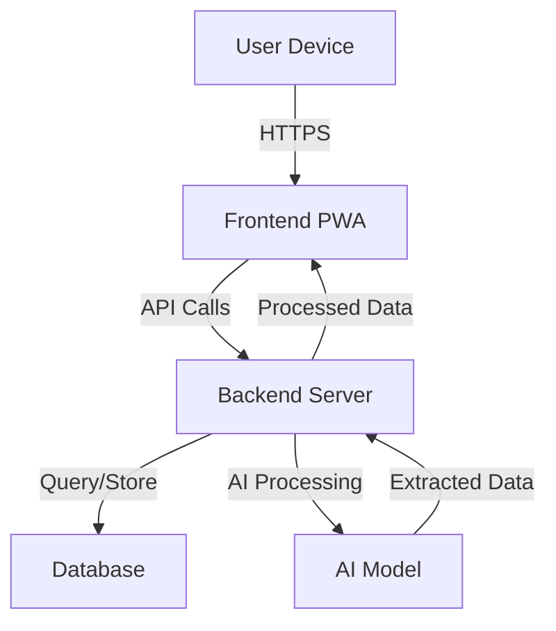
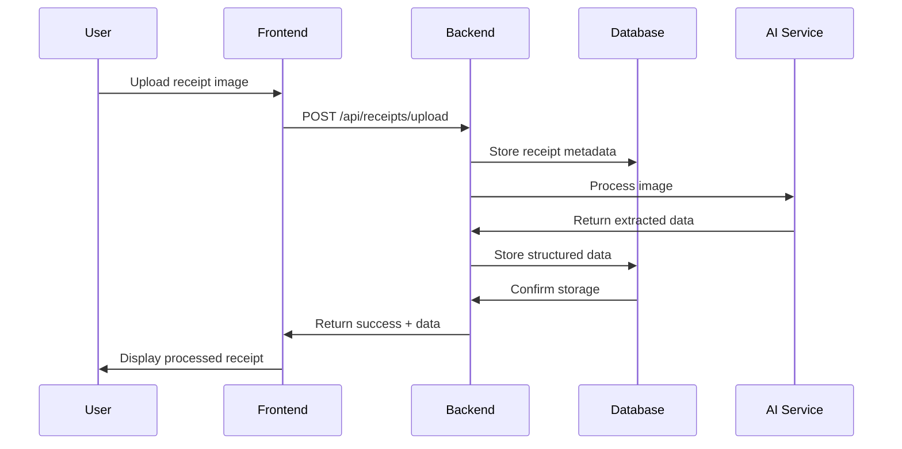

# Receipt Manager - Comprehensive Project Documentation

## Table of Contents

1. [Project Overview](#project-overview)
2. [System Architecture](#system-architecture)
3. [Technology Stack](#technology-stack)
4. [Backend Documentation](#backend-documentation)
5. [Frontend Documentation](#frontend-documentation)
6. [Database Documentation](#database-documentation)
7. [Deployment Documentation](#deployment-documentation)
8. [Monitoring and Maintenance](#monitoring-and-maintenance)
9. [Security](#security)
10. [API Reference](#api-reference)
11. [Development Guide](#development-guide)
12. [Troubleshooting](#troubleshooting)

---

## Project Overview

### Introduction

The **Receipt Manager** is a comprehensive web application designed to help small business owners digitize, organize, and manage their receipts using AI-powered OCR (Optical Character Recognition) technology. The system allows users to upload receipt images, automatically extract key data, and store it in a structured database for easy retrieval and analysis.

### Key Features

- **AI-Powered Receipt Processing**: Automatic extraction of vendor names, dates, amounts, and line items
- **Mobile-First Design**: Responsive interface that works on any device with camera support
- **Secure Authentication**: JWT-based authentication with role-based access control
- **Comprehensive Analytics**: Spending trends, category breakdowns, and business insights
- **Multi-User Support**: Business owners and team members can collaborate
- **Export Functionality**: CSV, Excel, and PDF export options
- **Real-time Processing**: Asynchronous receipt processing with status tracking

### Business Value

- **Time Savings**: Eliminates manual data entry from receipts
- **Accuracy**: AI-powered extraction reduces human error
- **Compliance**: Proper record keeping for tax purposes
- **Insights**: Data-driven business decisions through analytics
- **Scalability**: Handles growing receipt volumes as business expands

---

## System Architecture

### High-Level Architecture



### Component Breakdown

#### Frontend (Progressive Web App)
- **Technology**: React.js with Material-UI
- **Features**:
  - Responsive design for mobile/desktop
  - Camera access for receipt scanning
  - File upload interface
  - Data visualization dashboard
  - User authentication flows

#### Backend Server
- **Technology**: Node.js with Express
- **Features**:
  - RESTful API endpoints
  - Authentication middleware
  - File processing pipeline
  - Database ORM
  - AI model integration

#### Database
- **Technology**: Supabase (PostgreSQL)
- **Features**:
  - Structured data storage
  - Real-time subscriptions
  - Built-in authentication
  - Row Level Security (RLS)

#### AI Service
- **Technology**: Python-based OCR + NLP
- **Features**:
  - Receipt image preprocessing
  - Text extraction (OCR)
  - Data field identification
  - Validation and correction
  - Confidence scoring

### Data Flow



---

## Technology Stack

### Frontend
- **Framework**: React.js (v18)
- **UI Library**: Material-UI (MUI) v5
- **State Management**: React Query (Server state), Context API (Auth state)
- **Routing**: React Router v6
- **HTTP Client**: Axios
- **Styling**: Emotion (CSS-in-JS)
- **Forms**: Formik with Yup validation
- **Charts**: Chart.js with react-chartjs-2
- **Internationalization**: react-i18next

### Backend
- **Runtime**: Node.js (v16+)
- **Framework**: Express.js
- **Database**: Supabase (PostgreSQL)
- **Authentication**: JWT (JSON Web Tokens)
- **File Handling**: Multer (for uploads)
- **Validation**: express-validator
- **Security**: Helmet, CORS, Rate Limiting
- **Logging**: Winston
- **Testing**: Jest, Supertest

### Infrastructure
- **Deployment**: Vercel (Serverless)
- **Database**: Supabase
- **Storage**: Supabase Storage (for files)
- **Monitoring**: Vercel Analytics, Supabase Logs
- **CI/CD**: GitHub Actions

### Development Tools
- **Version Control**: Git
- **Package Management**: npm
- **Linting**: ESLint
- **Code Formatting**: Prettier
- **Testing**: Jest, React Testing Library
- **Documentation**: Markdown, Mermaid diagrams

---

## Backend Documentation

### Server Configuration

The backend server is configured in `server.js` with Express.js framework and includes:

#### Middleware Stack
- Security middleware (Helmet, CORS, compression)
- Body parsing with size limits
- Custom security headers
- Error handling middleware

#### Database Connection

The application uses Supabase as its database provider. Connection is established in `backend/supabaseClient.js`.

#### Route Structure

Routes are organized in the `backend/routes/` directory:

- `auth.js` - Authentication endpoints
- `receipts.js` - Receipt management endpoints
- `analytics.js` - Analytics and reporting endpoints
- `health.js` - Health check endpoints

### Controllers

#### AuthController

Handles user authentication and authorization:

- **register()**: User registration with business creation
- **login()**: User authentication and token generation
- **refreshToken()**: JWT token refresh
- **logout()**: Token revocation
- **forgotPassword()**: Password reset initiation
- **resetPassword()**: Password reset completion

#### ReceiptController

Manages receipt processing and management:

- **uploadReceipt()**: Handle file upload and initiate processing
- **processReceipt()**: Background processing with AI integration
- **getReceiptStatus()**: Check processing status
- **listReceipts()**: Paginated receipt listing with filters
- **getReceiptDetails()**: Detailed receipt information
- **deleteReceipt()**: Receipt removal
- **getReceiptFile()**: Original file download
- **getAnalytics()**: Receipt analytics and insights

### Models

#### User Model

Handles user data operations:

- **create()**: User registration
- **findByEmail()**: User lookup by email
- **validatePassword()**: Password verification
- **generateAuthToken()**: JWT token creation
- **storeRefreshToken()**: Refresh token storage

#### Receipt Model

Manages receipt data:

- **create()**: Receipt record creation
- **findById()**: Receipt lookup
- **findByBusiness()**: Business receipt listing
- **updateStatus()**: Processing status updates
- **addItems()**: Receipt item addition
- **getItems()**: Receipt items retrieval
- **delete()**: Receipt removal

### Services

#### AI Service

Integrates with Python-based AI processing for OCR and data extraction.

#### Receipt Service

Handles receipt business logic:

- File validation and storage
- Processing queue management
- Data transformation
- Error handling and retries

### Middleware

#### Authentication Middleware

Located in `backend/middlewares/authenticate.js` for JWT token validation and user authentication.

---

## Frontend Documentation

### Application Structure

The frontend is organized as a single-page application (SPA) with the following structure:

```
frontend/src/
├── components/          # Reusable UI components
│   ├── Header.js       # Top navigation bar
│   ├── Sidebar.js      # Navigation sidebar
│   ├── PrivateRoute.js # Route protection
│   └── ErrorBoundary.js # Error handling
├── pages/              # Page components
│   ├── DashboardPage.js
│   ├── LoginPage.js
│   ├── RegisterPage.js
│   ├── ReceiptsPage.js
│   ├── ReceiptDetailPage.js
│   ├── ScanPage.js
│   ├── AnalyticsPage.js
│   └── SettingsPage.js
├── context/            # React contexts
│   └── AuthContext.js  # Authentication state
├── services/           # API service functions
└── utils/              # Utility functions
```

### Theme Configuration

The application uses a custom Material-UI theme with a luxury dark design featuring gold and silver color scheme.

### Authentication Flow

Authentication is managed through the `AuthContext` with JWT token handling and automatic refresh.

### Key Components

#### Header Component

Provides top navigation and user menu in `frontend/src/components/Header.js`.

#### Sidebar Component

Navigation menu with route highlighting in `frontend/src/components/Sidebar.js`.

#### PrivateRoute Component

Protects authenticated routes in `frontend/src/components/PrivateRoute.js`.

### Page Components

#### DashboardPage

Main landing page with quick stats and actions:

- Receipt statistics cards
- Quick action buttons (Scan Receipt, View Receipts, View Analytics)
- Recent activity summary

#### ReceiptsPage

Receipt management interface:

- Receipt listing with pagination
- Search and filter functionality
- Bulk operations
- Status indicators

#### ScanPage

Receipt scanning interface:

- Camera access for mobile devices
- File upload fallback
- Real-time preview
- Processing status feedback

#### AnalyticsPage

Data visualization and reporting:

- Spending trends charts
- Category breakdowns
- Time period filters
- Export functionality

### API Integration

API calls are handled through React Query for caching and state management in the frontend services.

---

## Database Documentation

### Database Schema

The application uses Supabase (PostgreSQL) with the following core tables:

#### Users Table
```sql
CREATE TABLE users (
    user_id SERIAL PRIMARY KEY,
    email VARCHAR(255) UNIQUE NOT NULL,
    password_hash VARCHAR(255) NOT NULL,
    full_name VARCHAR(255) NOT NULL,
    phone_number VARCHAR(20),
    created_at TIMESTAMP DEFAULT CURRENT_TIMESTAMP,
    last_login TIMESTAMP,
    is_active BOOLEAN DEFAULT TRUE,
    role VARCHAR(20) DEFAULT 'business_owner'
);
```

#### Businesses Table
```sql
CREATE TABLE businesses (
    business_id SERIAL PRIMARY KEY,
    user_id INTEGER REFERENCES users(user_id),
    business_name VARCHAR(255) NOT NULL,
    business_type VARCHAR(100),
    address TEXT,
    tax_id VARCHAR(50),
    created_at TIMESTAMP DEFAULT CURRENT_TIMESTAMP,
    is_active BOOLEAN DEFAULT TRUE
);
```

#### Receipts Table
```sql
CREATE TABLE receipts (
    receipt_id SERIAL PRIMARY KEY,
    business_id INTEGER REFERENCES businesses(business_id),
    original_filename VARCHAR(255),
    storage_path VARCHAR(512),
    vendor_name VARCHAR(255),
    receipt_date DATE,
    total_amount DECIMAL(10,2),
    payment_method VARCHAR(50),
    currency VARCHAR(3),
    processed_at TIMESTAMP DEFAULT CURRENT_TIMESTAMP,
    status VARCHAR(20) DEFAULT 'processed',
    raw_text TEXT,
    confidence_score DECIMAL(5,2)
);
```

#### Receipt Items Table
```sql
CREATE TABLE receipt_items (
    item_id SERIAL PRIMARY KEY,
    receipt_id INTEGER REFERENCES receipts(receipt_id),
    item_description TEXT,
    quantity DECIMAL(10,2),
    unit_price DECIMAL(10,2),
    total_price DECIMAL(10,2),
    category VARCHAR(100),
    tax_amount DECIMAL(10,2)
);
```

### Indexes

Performance-optimized indexes:

```sql
CREATE INDEX idx_receipts_business ON receipts(business_id);
CREATE INDEX idx_receipts_date ON receipts(receipt_date);
CREATE INDEX idx_receipt_items ON receipt_items(receipt_id);
CREATE INDEX idx_users_email ON users(email);
```

### Supabase Integration

#### Client Configuration

Supabase client is configured in `backend/supabaseClient.js` with connection pooling and error handling.

#### Row Level Security (RLS)

Supabase RLS policies ensure data security:

```sql
-- Enable RLS
ALTER TABLE users ENABLE ROW LEVEL SECURITY;
ALTER TABLE businesses ENABLE ROW LEVEL SECURITY;
ALTER TABLE receipts ENABLE ROW LEVEL SECURITY;
ALTER TABLE receipt_items ENABLE ROW LEVEL SECURITY;

-- Users can only access their own data
CREATE POLICY "Users can view own data" ON users
    FOR SELECT USING (auth.uid() = user_id);

-- Businesses belong to users
CREATE POLICY "Users can view own businesses" ON businesses
    FOR SELECT USING (user_id = auth.uid());

-- Receipts belong to user's businesses
CREATE POLICY "Users can view own receipts" ON receipts
    FOR SELECT USING (
        business_id IN (
            SELECT business_id FROM businesses
            WHERE user_id = auth.uid()
        )
    );
```

#### Storage Integration

File storage is handled through Supabase Storage with secure access controls and automatic cleanup.

### Data Relationships

```
Users (1) ──── (N) Businesses
    │
    └── (1) ──── (N) Receipts
                      │
                      └── (1) ──── (N) Receipt Items
```

### Backup and Recovery

- **Automatic Backups**: Supabase provides daily backups
- **Point-in-Time Recovery**: Available for 7 days
- **Manual Exports**: Data can be exported via API
- **Retention Policy**: 30 days for automated backups

---

## Deployment Documentation

### Vercel Deployment

The application is configured for serverless deployment on Vercel:

#### vercel.json Configuration
```json
{
    "version": 2,
    "builds": [
        {
            "src": "server.js",
            "use": "@vercel/node"
        },
        {
            "src": "package.json",
            "use": "@vercel/static-build",
            "config": {
                "distDir": "frontend/build"
            }
        }
    ],
    "routes": [
        {
            "src": "/api/(.*)",
            "dest": "/server.js"
        },
        {
            "src": "/(.*)",
            "dest": "/frontend/$1"
        }
    ],
    "env": {
        "NODE_ENV": "production"
    }
}
```

#### Environment Variables

Required environment variables for production:

```bash
# Application
APP_PORT=3000
APP_ENV=production
JWT_SECRET=your_secure_jwt_secret
JWT_EXPIRES_IN=15m

# Database
SUPABASE_URL=https://your-project.supabase.co
SUPABASE_KEY=your-supabase-anon-key

# Storage
SUPABASE_STORAGE_URL=https://your-project.supabase.co/storage/v1
SUPABASE_STORAGE_KEY=your-storage-key

# AI Service
AI_SERVICE_URL=https://your-ai-service.com/process

# Logging
LOG_LEVEL=info
LOG_FILE=./logs/app.log

# Security
CORS_ORIGINS=https://your-domain.com
```

### Build Process

#### Frontend Build
```bash
cd frontend
npm install
npm run build
```

#### Backend Build
```bash
npm install
npm run build:backend  # If using Babel/TypeScript
```

#### Combined Build
```bash
npm run build  # Builds both frontend and backend
```

### Deployment Steps

1. **Connect Repository**: Link GitHub repository to Vercel
2. **Configure Environment**: Set environment variables in Vercel dashboard
3. **Set Build Settings**:
   - Build Command: `npm run vercel-build`
   - Output Directory: `frontend/build` (for frontend)
   - Install Command: `npm install`
4. **Deploy**: Push to main branch or trigger manual deployment

### Supabase Setup

1. **Create Project**: Set up new Supabase project
2. **Configure Database**: Run migrations and seed data
3. **Set up Storage**: Create buckets for receipt files
4. **Configure Auth**: Set up authentication providers
5. **Set RLS Policies**: Implement row-level security

### Monitoring

#### Vercel Analytics
- Real-time performance metrics
- Error tracking
- Function execution logs
- Bandwidth usage

#### Supabase Monitoring
- Database performance
- API usage statistics
- Storage metrics
- Real-time metrics

### Scaling Considerations

#### Horizontal Scaling
- Vercel automatically scales serverless functions
- Supabase handles database scaling
- CDN integration for static assets

#### Performance Optimization
- Code splitting for frontend bundles
- Database query optimization
- Caching strategies
- Image optimization

---

## Monitoring and Maintenance

### Application Monitoring

#### Health Checks

Health endpoints are available at `/api/health` for monitoring system status and service availability.

#### Logging

Winston logger configuration with structured logging, file rotation, and multiple transport options.

### Database Maintenance

#### Regular Tasks

- **Daily**: Backup verification
- **Weekly**: Log rotation and cleanup
- **Monthly**: Performance optimization, dependency updates
- **Quarterly**: Security audits, capacity planning
- **Annually**: Major version updates, architecture review

#### Performance Monitoring

Key metrics to monitor:

- Query execution time
- Connection pool utilization
- Index usage statistics
- Table bloat
- Vacuum and analyze operations

### Security Maintenance

#### Regular Security Tasks

- **Dependency Updates**: Weekly security patches
- **Vulnerability Scans**: Monthly automated scans
- **Access Review**: Quarterly permission audits
- **Security Audits**: Annual comprehensive review

#### Incident Response

1. **Detection**: Monitor alerts and logs
2. **Assessment**: Evaluate impact and scope
3. **Containment**: Isolate affected systems
4. **Recovery**: Restore from backups
5. **Lessons Learned**: Update procedures

### Backup Strategy

#### Database Backups

- **Automated**: Daily via Supabase
- **Manual**: Before major deployments
- **Retention**: 30 days for automated, 1 year for manual
- **Testing**: Monthly restore testing

#### File Backups

- **Storage**: Supabase Storage with redundancy
- **Retention**: 7 years for tax compliance
- **Access**: Secure, encrypted storage

### Performance Optimization

#### Frontend Optimization

- Code splitting and lazy loading
- Image optimization and WebP format
- Bundle analysis and tree shaking
- CDN integration

#### Backend Optimization

- Database query optimization
- Caching layer implementation
- Rate limiting and throttling
- Connection pooling

#### Database Optimization

- Index maintenance
- Query performance tuning
- Connection pooling
- Read replica implementation

---

## Security

### Authentication & Authorization

#### JWT Implementation

JWT tokens are generated with user information and configurable expiration times.

#### Password Security

- **Hashing**: bcrypt with salt rounds
- **Minimum Requirements**: 8+ characters, mixed case, numbers, symbols
- **Reset Policy**: Secure token-based reset with expiration

#### Session Management

- **Token Expiration**: 15 minutes for access tokens
- **Refresh Tokens**: 7 days with secure storage
- **Automatic Renewal**: Seamless token refresh

### Data Protection

#### Encryption

- **Data in Transit**: TLS 1.3 encryption
- **Data at Rest**: AES-256 encryption in Supabase
- **File Storage**: Encrypted storage with access controls

#### Privacy Compliance

- **GDPR**: EU user data protection
- **CCPA**: California consumer privacy
- **Data Retention**: Configurable retention policies
- **Right to Deletion**: User data removal capabilities

### API Security

#### Rate Limiting

Rate limiting is implemented using express-rate-limit to prevent abuse and ensure fair usage.

#### Input Validation

Input validation is implemented using express-validator for comprehensive request validation and sanitization.

#### CORS Configuration

CORS is configured to allow cross-origin requests from specified domains with proper headers and credentials support.

### File Security

#### Upload Validation

- **File Type Checking**: Only allow image formats (JPEG, PNG, PDF)
- **Size Limits**: Maximum 10MB per file
- **Virus Scanning**: Integration with antivirus service
- **Content Validation**: Image format verification

#### Storage Security

- **Access Control**: Supabase RLS policies
- **Signed URLs**: Time-limited access to files
- **Encryption**: Server-side encryption
- **Backup Security**: Encrypted backup storage

### Security Headers

Security headers are implemented using Helmet.js for comprehensive protection against common web vulnerabilities.

### Security Monitoring

#### Audit Logging

- **Authentication Events**: Login, logout, failed attempts
- **Data Access**: Receipt views, modifications
- **File Operations**: Uploads, downloads, deletions
- **Admin Actions**: User management, configuration changes

#### Alert System

- **Failed Login Attempts**: Brute force detection
- **Suspicious Activity**: Unusual access patterns
- **Security Events**: Configuration changes, policy violations
- **System Alerts**: Security patch requirements

---

## API Reference

### Authentication Endpoints

#### POST /api/auth/register
Register a new user account.

**Request Body:**
```json
{
    "email": "user@example.com",
    "password": "securepassword123",
    "full_name": "John Doe",
    "business_name": "Doe Enterprises",
    "phone_number": "+1234567890"
}
```

**Response:**
```json
{
    "user": {
        "user_id": 1,
        "email": "user@example.com",
        "full_name": "John Doe",
        "role": "business_owner"
    },
    "business": {
        "business_id": 1,
        "business_name": "Doe Enterprises"
    },
    "auth_token": "jwt_token_here",
    "refresh_token": "refresh_token_here",
    "expires_in": "15m"
}
```

#### POST /api/auth/login
Authenticate user and receive tokens.

**Request Body:**
```json
{
    "email": "user@example.com",
    "password": "securepassword123"
}
```

#### POST /api/auth/refresh
Refresh access token using refresh token.

**Request Body:**
```json
{
    "refreshToken": "refresh_token_here"
}
```

### Receipt Endpoints

#### POST /api/receipts/upload
Upload a receipt for processing.

**Content-Type:** `multipart/form-data`

**Form Data:**
- `business_id`: Business ID
- `receipt`: File (image)

**Response:**
```json
{
    "receipt_id": 123,
    "status": "processing",
    "message": "Receipt uploaded successfully, processing started"
}
```

#### GET /api/receipts
List receipts for authenticated user.

**Query Parameters:**
- `limit`: Number of receipts (default: 50)
- `offset`: Pagination offset (default: 0)
- `start_date`: Filter start date (YYYY-MM-DD)
- `end_date`: Filter end date (YYYY-MM-DD)
- `vendor`: Filter by vendor name
- `min_amount`: Minimum amount filter
- `max_amount`: Maximum amount filter

**Response:**
```json
{
    "total_count": 150,
    "receipts": [
        {
            "receipt_id": 123,
            "vendor_name": "Sample Store",
            "receipt_date": "2023-12-01",
            "total_amount": 125.50,
            "status": "processed",
            "processed_at": "2023-12-01T10:30:00Z"
        }
    ]
}
```

#### GET /api/receipts/:id
Get detailed receipt information.

**Response:**
```json
{
    "receipt_id": 123,
    "business_id": 1,
    "original_filename": "receipt.jpg",
    "vendor_name": "Sample Store",
    "receipt_date": "2023-12-01",
    "total_amount": 125.50,
    "payment_method": "Credit Card",
    "currency": "USD",
    "status": "processed",
    "processed_at": "2023-12-01T10:30:00Z",
    "items": [
        {
            "item_id": 456,
            "description": "Sample Item",
            "quantity": 2,
            "unit_price": 15.99,
            "total_price": 31.98,
            "category": "Food"
        }
    ]
}
```

#### DELETE /api/receipts/:id
Delete a receipt.

**Response:**
```json
{
    "message": "Receipt deleted successfully"
}
```

#### GET /api/receipts/:id/file
Download original receipt file.

**Response:** Binary file data

### Analytics Endpoints

#### GET /api/analytics/summary
Get spending analytics summary.

**Query Parameters:**
- `start_date`: Analysis start date
- `end_date`: Analysis end date

**Response:**
```json
{
    "total_receipts": 150,
    "total_spending": 15750.00,
    "average_per_receipt": 105.00,
    "first_receipt_date": "2023-01-01",
    "last_receipt_date": "2023-12-31",
    "top_categories": [
        {
            "category": "Office Supplies",
            "amount": 5200.00,
            "percentage": 33.0
        }
    ]
}
```

### Health Check Endpoints

#### GET /api/health
System health check.

**Response:**
```json
{
    "status": "healthy",
    "timestamp": "2023-12-01T10:30:00Z",
    "services": {
        "database": true,
        "ai_service": true,
        "storage": true
    }
}
```

---

## Development Guide

### Local Development Setup

#### Prerequisites

- Node.js 16+
- npm or yarn
- Git
- Supabase account

#### Installation

1. **Clone Repository**
```bash
git clone https://github.com/your-org/receipt-manager.git
cd receipt-manager
```

2. **Install Dependencies**
```bash
npm install
cd frontend && npm install && cd ..
```

3. **Environment Configuration**
```bash
cp .env.example .env
# Edit .env with your local configuration
```

4. **Database Setup**
```bash
# Set up Supabase project
# Run migrations if using local PostgreSQL
npm run migrate
npm run seed
```

5. **Start Development Servers**
```bash
# Terminal 1: Backend
npm run dev

# Terminal 2: Frontend
cd frontend && npm start
```

### Development Workflow

#### Branching Strategy

- `main`: Production-ready code
- `develop`: Development integration branch
- `feature/*`: Feature branches
- `bugfix/*`: Bug fix branches
- `release/*`: Release preparation

#### Code Standards

- **ESLint**: JavaScript/React linting
- **Prettier**: Code formatting
- **Husky**: Pre-commit hooks
- **Conventional Commits**: Standardized commit messages

#### Testing Strategy

```bash
# Run all tests
npm test

# Run unit tests
npm run test:unit

# Run integration tests
npm run test:integration

# Run with coverage
npm run test:coverage
```

### Contributing Guidelines

1. **Fork** the repository
2. **Create** a feature branch
3. **Make** your changes with tests
4. **Run** the test suite
5. **Commit** using conventional commits
6. **Push** to your fork
7. **Create** a Pull Request

#### Commit Message Format

```
type(scope): description

[optional body]

[optional footer]
```

Types: `feat`, `fix`, `docs`, `style`, `refactor`, `test`, `chore`

### Code Organization

#### Frontend Structure

```
frontend/src/
├── components/     # Reusable components
├── pages/         # Route components
├── context/       # React contexts
├── hooks/         # Custom hooks
├── services/      # API services
├── utils/         # Utility functions
├── styles/        # Global styles
└── assets/        # Static assets
```

#### Backend Structure

```
backend/
├── controllers/   # Route controllers
├── models/        # Data models
├── routes/        # API routes
├── services/      # Business logic
├── middlewares/   # Express middlewares
├── utils/         # Utility functions
└── config/        # Configuration files
```

### Performance Optimization

#### Frontend

- **Code Splitting**: Route-based and component-based splitting
- **Lazy Loading**: Images and heavy components
- **Bundle Analysis**: Use `webpack-bundle-analyzer`
- **Caching**: Service worker for static assets

#### Backend

- **Database Indexing**: Optimize query performance
- **Caching**: Redis for session and data caching
- **Compression**: Gzip compression for responses
- **Connection Pooling**: Database connection optimization

### Debugging

#### Frontend Debugging

- **React DevTools**: Component inspection
- **Redux DevTools**: State debugging
- **Browser DevTools**: Network and performance analysis

#### Backend Debugging

- **Node Inspector**: `node --inspect server.js`
- **Winston Logging**: Structured logging
- **Database Query Logging**: SQL query analysis

---

## Troubleshooting

### Common Issues

#### Database Connection Issues

**Problem:** Unable to connect to Supabase
**Solution:**
1. Verify environment variables
2. Check Supabase project status
3. Confirm network connectivity
4. Review Supabase dashboard for issues

#### Authentication Problems

**Problem:** Users unable to login
**Solution:**
1. Check JWT secret configuration
2. Verify token expiration settings
3. Review authentication middleware
4. Check password hashing consistency

#### File Upload Failures

**Problem:** Receipt uploads failing
**Solution:**
1. Verify file size limits
2. Check supported file types
3. Confirm storage bucket permissions
4. Review multer configuration

#### AI Processing Errors

**Problem:** Receipt processing not working
**Solution:**
1. Check AI service connectivity
2. Verify API keys and endpoints
3. Review processing queue status
4. Check for service outages

### Performance Issues

#### Slow Page Loads

**Diagnosis:**
1. Check network tab for large assets
2. Analyze bundle size
3. Review database query performance
4. Check for memory leaks

**Solutions:**
- Implement code splitting
- Optimize images
- Add database indexes
- Implement caching

#### High Memory Usage

**Diagnosis:**
1. Monitor Node.js memory usage
2. Check for memory leaks
3. Review connection pooling
4. Analyze heap dumps

**Solutions:**
- Implement connection pooling
- Add memory monitoring
- Optimize data structures
- Implement garbage collection tuning

### Deployment Issues

#### Build Failures

**Common Causes:**
- Missing environment variables
- Dependency conflicts
- Build tool configuration issues
- Platform-specific code

**Resolution Steps:**
1. Check build logs
2. Verify environment configuration
3. Test locally with production settings
4. Update dependencies

#### Runtime Errors

**Common Issues:**
- Environment variable mismatches
- Database migration issues
- File permission problems
- Service dependency failures

**Debugging:**
1. Check application logs
2. Verify environment variables
3. Test database connectivity
4. Review service health checks

### Monitoring and Alerts

#### Setting up Alerts

1. **Error Rate Alerts**: Notify when error rate exceeds threshold
2. **Performance Alerts**: Alert on slow response times
3. **Availability Alerts**: Monitor service uptime
4. **Resource Alerts**: CPU, memory, and disk usage monitoring

#### Log Analysis

- **Centralized Logging**: Use services like LogRocket or Sentry
- **Log Aggregation**: Implement ELK stack or similar
- **Error Tracking**: Set up error monitoring and reporting
- **Performance Monitoring**: Track key metrics and KPIs

### Support Resources

#### Documentation
- [Supabase Documentation](https://supabase.com/docs)
- [Vercel Documentation](https://vercel.com/docs)
- [React Documentation](https://reactjs.org/docs)
- [Material-UI Documentation](https://mui.com/material-ui/getting-started/overview/)

#### Community Support
- GitHub Issues
- Stack Overflow
- Supabase Community
- Vercel Community

#### Professional Support
- Supabase Enterprise Support
- Vercel Enterprise Support
- Development consultancy

---

*This documentation is maintained by the Receipt Manager development team. For questions or contributions, please contact the development team or create an issue in the project repository.*