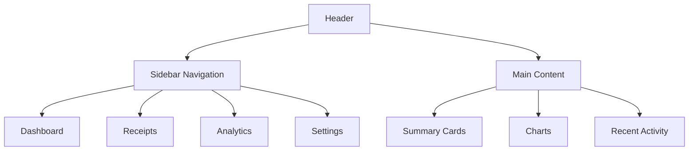

# Admin Dashboard Design

## 1. Dashboard Overview

### Main Dashboard Layout


### Dashboard Components
```jsx
<AdminDashboard>
  <DashboardHeader user={user} business={business} />
  <SidebarNavigation activeItem="dashboard" />

  <MainContent>
    <SummaryCards
      totalReceipts={125}
      totalSpending={15250.75}
      avgProcessingTime={3.2}
      storageUsed={4.5}
    />

    <ChartSection>
      <SpendingTrendChart data={monthlyData} />
      <CategoryBreakdownChart data={categoryData} />
    </ChartSection>

    <RecentActivity
      activities={recentReceipts}
      onViewAll={() => navigate('/receipts')}
    />
  </MainContent>
</AdminDashboard>
```

## 2. Key Dashboard Pages

### Receipts Management
```jsx
<ReceiptsPage>
  <PageHeader
    title="All Receipts"
    actions={[
      { label: 'Upload', icon: <UploadIcon />, onClick: openUploadModal },
      { label: 'Export', icon: <ExportIcon />, onClick: handleExport }
    ]}
  />

  <FilterBar
    filters={filters}
    onFilterChange={setFilters}
    dateRange={dateRange}
    onDateRangeChange={setDateRange}
  />

  <ReceiptsTable
    receipts={filteredReceipts}
    loading={loading}
    onSort={handleSort}
    onRowClick={handleRowClick}
    selectedReceipts={selectedReceipts}
    onSelect={handleSelect}
  />

  <Pagination
    total={totalReceipts}
    page={currentPage}
    onPageChange={setCurrentPage}
    pageSize={pageSize}
    onPageSizeChange={setPageSize}
  />
</ReceiptsPage>
```

### Analytics Dashboard
```jsx
<AnalyticsDashboard>
  <AnalyticsHeader
    title="Business Insights"
    dateRange={dateRange}
    onDateRangeChange={setDateRange}
  />

  <MetricsGrid>
    <MetricCard
      title="Total Spending"
      value={formatCurrency(totalSpending)}
      change={monthlyChange}
      icon={<DollarIcon />}
    />
    <MetricCard
      title="Avg per Receipt"
      value={formatCurrency(avgPerReceipt)}
      change={avgChange}
      icon={<ReceiptIcon />}
    />
    <MetricCard
      title="Top Category"
      value={topCategory.name}
      percentage={topCategory.percentage}
      icon={<CategoryIcon />}
    />
  </MetricsGrid>

  <ChartsSection>
    <TimeSeriesChart
      title="Spending Over Time"
      data={timeSeriesData}
      height={300}
    />
    <PieChart
      title="Spending by Category"
      data={categoryData}
      height={300}
    />
  </ChartsSection>

  <InsightsPanel insights={generatedInsights} />
</AnalyticsDashboard>
```

## 3. Business Settings

### Business Profile Management
```jsx
<BusinessSettings>
  <SettingsHeader title="Business Settings" />

  <TabNavigation
    tabs={[
      { id: 'profile', label: 'Business Profile' },
      { id: 'users', label: 'Team Members' },
      { id: 'integrations', label: 'Integrations' },
      { id: 'billing', label: 'Billing' }
    ]}
    activeTab={activeTab}
    onTabChange={setActiveTab}
  />

  {activeTab === 'profile' && (
    <BusinessProfileForm
      business={business}
      onSubmit={handleProfileUpdate}
      loading={loading}
    />
  )}

  {activeTab === 'users' && (
    <TeamManagement
      users={teamMembers}
      onInvite={handleInvite}
      onRemove={handleRemove}
    />
  )}
</BusinessSettings>
```

## 4. Data Visualization Components

### Interactive Charts
```jsx
const SpendingTrendChart = ({ data, height = 300 }) => {
  const chartData = {
    labels: data.map(item => item.date),
    datasets: [
      {
        label: 'Total Spending',
        data: data.map(item => item.amount),
        borderColor: '#3B82F6',
        backgroundColor: 'rgba(59, 130, 246, 0.1)',
        tension: 0.4,
        fill: true
      }
    ]
  };

  const options = {
    responsive: true,
    maintainAspectRatio: false,
    plugins: {
      legend: { display: false },
      tooltip: {
        callbacks: {
          label: (context) => `$${context.parsed.y.toFixed(2)}`
        }
      }
    },
    scales: {
      y: {
        beginAtZero: true,
        ticks: {
          callback: (value) => `$${value}`
        }
      }
    }
  };

  return (
    <div style={{ height }}>
      <Line data={chartData} options={options} />
    </div>
  );
};
```

### Custom Data Tables
```jsx
const ReceiptsTable = ({
  receipts,
  loading,
  onSort,
  onRowClick,
  selectedReceipts,
  onSelect
}) => {
  const columns = [
    {
      Header: 'Date',
      accessor: 'date',
      Cell: ({ value }) => formatDate(value),
      width: 120
    },
    {
      Header: 'Vendor',
      accessor: 'vendor',
      width: 200
    },
    {
      Header: 'Amount',
      accessor: 'total',
      Cell: ({ value }) => formatCurrency(value),
      width: 120
    },
    {
      Header: 'Status',
      accessor: 'status',
      Cell: ({ value }) => <StatusBadge status={value} />,
      width: 100
    },
    {
      Header: 'Actions',
      Cell: ({ row }) => (
        <ActionMenu
          onView={() => onRowClick(row.original)}
          onEdit={() => handleEdit(row.original)}
          onDelete={() => handleDelete(row.original)}
        />
      ),
      width: 80
    }
  ];

  return (
    <TableContainer>
      <ReactTable
        columns={columns}
        data={receipts}
        loading={loading}
        onSort={onSort}
        selectedRows={selectedReceipts}
        onSelect={onSelect}
        onRowClick={onRowClick}
        pageSize={10}
      />
    </TableContainer>
  );
};
```

## 5. Export Functionality

### Data Export Options
```jsx
const ExportMenu = ({ onExport }) => {
  const exportOptions = [
    {
      label: 'Export as CSV',
      format: 'csv',
      icon: <CsvIcon />
    },
    {
      label: 'Export as Excel',
      format: 'xlsx',
      icon: <ExcelIcon />
    },
    {
      label: 'Export as PDF',
      format: 'pdf',
      icon: <PdfIcon />
    },
    {
      label: 'Export Summary',
      format: 'summary',
      icon: <SummaryIcon />
    }
  ];

  return (
    <DropdownMenu>
      <DropdownMenuTrigger asChild>
        <Button variant="outline">
          <ExportIcon className="mr-2" />
          Export
        </Button>
      </DropdownMenuTrigger>
      <DropdownMenuContent>
        {exportOptions.map(option => (
          <DropdownMenuItem
            key={option.format}
            onClick={() => onExport(option.format)}
          >
            {option.icon}
            <span className="ml-2">{option.label}</span>
          </DropdownMenuItem>
        ))}
      </DropdownMenuContent>
    </DropdownMenu>
  );
};
```

## 6. Responsive Design

### Mobile Dashboard Adaptation
```jsx
const ResponsiveDashboard = () => {
  const isMobile = useMediaQuery('(max-width: 768px)');

  return (
    <DashboardLayout>
      {isMobile ? (
        <MobileDashboardView />
      ) : (
        <DesktopDashboardView />
      )}

      <ResponsiveNavigation />
    </DashboardLayout>
  );
};

const MobileDashboardView = () => {
  return (
    <div className="mobile-dashboard">
      <MobileHeader />
      <ScrollableContent>
        <SummaryCards mobile />
        <ChartCarousel>
          <ChartCard title="Spending Trend">
            <MiniSpendingChart />
          </ChartCard>
          <ChartCard title="Categories">
            <MiniPieChart />
          </ChartCard>
        </ChartCarousel>
        <RecentActivity mobile />
      </ScrollableContent>
      <MobileNavigation />
    </div>
  );
};
```

## 7. Accessibility Features

### Keyboard Navigation
```jsx
const AccessibleTable = ({ data, columns }) => {
  const [focusedRow, setFocusedRow] = useState(null);

  const handleKeyDown = (e, rowIndex) => {
    switch (e.key) {
      case 'ArrowUp':
        e.preventDefault();
        setFocusedRow(Math.max(0, rowIndex - 1));
        break;
      case 'ArrowDown':
        e.preventDefault();
        setFocusedRow(Math.min(data.length - 1, rowIndex + 1));
        break;
      case 'Enter':
        e.preventDefault();
        onRowSelect(data[rowIndex]);
        break;
      default:
        break;
    }
  };

  return (
    <table
      role="grid"
      aria-label="Receipts list"
      className="accessible-table"
    >
      <thead>
        <tr role="row">
          {columns.map(column => (
            <th key={column.accessor} role="columnheader">
              {column.Header}
            </th>
          ))}
        </tr>
      </thead>
      <tbody>
        {data.map((row, index) => (
          <tr
            key={row.id}
            role="row"
            tabIndex={focusedRow === index ? 0 : -1}
            onKeyDown={(e) => handleKeyDown(e, index)}
            onClick={() => onRowSelect(row)}
            aria-selected={focusedRow === index}
          >
            {columns.map(column => (
              <td key={`${row.id}-${column.accessor}`} role="gridcell">
                {column.Cell ? column.Cell({ value: row[column.accessor] }) : row[column.accessor]}
              </td>
            ))}
          </tr>
        ))}
      </tbody>
    </table>
  );
};