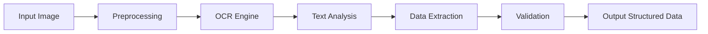

# AI Model Design for Receipt Data Extraction

## 1. Model Architecture

### Processing Pipeline


### Component Details

#### Image Preprocessing
- Convert to grayscale
- Binarization (Otsu's method)
- Noise removal
- Deskewing
- Perspective correction

#### OCR Engine
- **Primary**: Tesseract OCR
- **Fallback**: Google Cloud Vision API
- **Language Models**: English + Bengali
- **Configuration**: Page segmentation mode 6 (assume single uniform block)

#### Text Analysis
- Regular expression patterns for common receipt fields
- NLP for vendor name extraction
- Date format detection and normalization
- Currency and amount parsing
- Item description analysis

#### Data Extraction
- Field-specific extractors:
  - Vendor: Logo detection + text analysis
  - Date: Multiple format parsing
  - Total: Amount detection with context
  - Items: Table structure analysis
  - Payment: Method identification

## 2. Implementation Approach

### Python Implementation
```python
class ReceiptProcessor:
    def __init__(self):
        self.ocr_engine = TesseractOCR()
        self.nlp_model = spacy.load('en_core_web_sm')
        self.date_parser = DateParser()
        self.currency_detector = CurrencyDetector()

    def process_receipt(self, image_path):
        # Step 1: Preprocess image
        processed_image = self._preprocess_image(image_path)

        # Step 2: Extract text
        raw_text = self.ocr_engine.extract_text(processed_image)

        # Step 3: Analyze structure
        structure = self._analyze_receipt_structure(raw_text)

        # Step 4: Extract data fields
        extracted_data = {
            'vendor': self._extract_vendor(raw_text, structure),
            'date': self._extract_date(raw_text),
            'total': self._extract_total(raw_text),
            'items': self._extract_items(raw_text, structure),
            'payment_method': self._extract_payment_method(raw_text)
        }

        # Step 5: Validate and clean
        validated_data = self._validate_data(extracted_data)

        return validated_data

    def _extract_vendor(self, text, structure):
        # Implement vendor extraction logic
        pass

    def _extract_date(self, text):
        # Implement date extraction with multiple format support
        pass

    # ... other extraction methods
```

### Machine Learning Enhancement
```python
class ReceiptFieldClassifier:
    def __init__(self):
        # Load pre-trained model
        self.model = load_model('receipt_field_classifier.h5')
        self.label_encoder = load_label_encoder()

    def classify_fields(self, text_blocks):
        # Convert text blocks to features
        features = self._extract_features(text_blocks)

        # Predict field types
        predictions = self.model.predict(features)

        # Return classified fields
        return {
            block: self.label_encoder.inverse_transform([pred])
            for block, pred in zip(text_blocks, predictions)
        }
```

## 3. Training Data Requirements

### Sample Dataset Structure
```
dataset/
├── images/
│   ├── receipt_001.jpg
│   ├── receipt_002.png
│   └── ...
├── annotations/
│   ├── receipt_001.json
│   ├── receipt_002.json
│   └── ...
└── metadata.csv
```

### Annotation Format
```json
{
  "image": "receipt_001.jpg",
  "fields": {
    "vendor": {
      "text": "ABC Restaurant",
      "bbox": [120, 45, 300, 60],
      "confidence": 0.95
    },
    "date": {
      "text": "15/11/2023",
      "bbox": [400, 40, 150, 25],
      "confidence": 0.88
    },
    "total": {
      "text": "125.50",
      "bbox": [380, 220, 100, 30],
      "confidence": 0.92
    },
    "items": [
      {
        "description": "Chicken Biryani",
        "quantity": "2",
        "price": "31.98",
        "bbox": [50, 100, 400, 150]
      }
    ]
  }
}
```

## 4. Performance Optimization

### Caching Strategy
- Cache processed receipts by hash
- Store extraction patterns for known vendors
- Cache OCR results for similar receipt layouts

### Parallel Processing
- Batch processing for multiple receipts
- GPU acceleration for OCR
- Multi-threaded field extraction

### Error Handling
- Confidence scoring for each field
- Fallback mechanisms for low-confidence extractions
- Manual correction interface

## 5. Deployment Considerations

### Containerization
```dockerfile
FROM python:3.9-slim

WORKDIR /app

COPY requirements.txt .
RUN pip install --no-cache-dir -r requirements.txt

COPY . .

CMD ["gunicorn", "--bind", "0.0.0.0:5000", "app:app"]
```

### Scaling
- Horizontal scaling with load balancing
- Queue-based processing (RabbitMQ/Celery)
- Auto-scaling based on queue depth
- Regional deployment for low latency