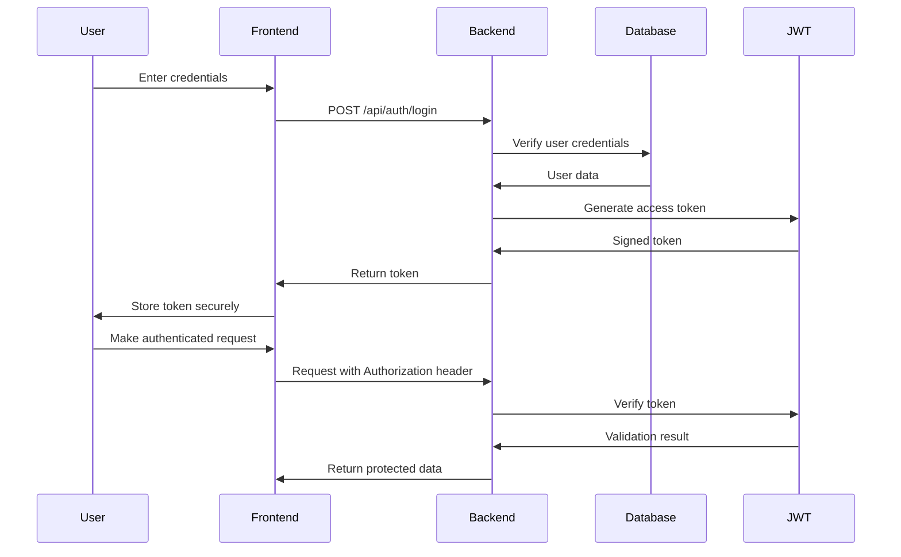

# Authentication System Design

## 1. Authentication Flow



## 2. Security Implementation

### Password Hashing
```javascript
const bcrypt = require('bcrypt');
const saltRounds = 12;

async function hashPassword(password) {
  return await bcrypt.hash(password, saltRounds);
}

async function verifyPassword(password, hash) {
  return await bcrypt.compare(password, hash);
}
```

### JWT Configuration
```javascript
const jwt = require('jsonwebtoken');

const JWT_CONFIG = {
  secret: process.env.JWT_SECRET || 'super-secret-key-change-in-production',
  accessTokenExpiry: '15m', // Short-lived access tokens
  refreshTokenExpiry: '7d', // Longer-lived refresh tokens
  issuer: 'receipt-manager-api',
  audience: 'receipt-manager-client'
};

function generateAccessToken(user) {
  return jwt.sign(
    {
      userId: user.user_id,
      businessId: user.business_id,
      email: user.email,
      role: user.role
    },
    JWT_CONFIG.secret,
    {
      expiresIn: JWT_CONFIG.accessTokenExpiry,
      issuer: JWT_CONFIG.issuer,
      audience: JWT_CONFIG.audience
    }
  );
}
```

## 3. Authentication Middleware

### Express Middleware
```javascript
function authenticateToken(req, res, next) {
  // Get token from header
  const authHeader = req.headers['authorization'];
  const token = authHeader && authHeader.split(' ')[1];

  if (!token) {
    return res.status(401).json({
      error: {
        code: 'UNAUTHORIZED',
        message: 'Authentication token required'
      }
    });
  }

  jwt.verify(token, JWT_CONFIG.secret, (err, user) => {
    if (err) {
      return res.status(403).json({
        error: {
          code: 'FORBIDDEN',
          message: 'Invalid or expired token'
        }
      });
    }

    // Attach user to request
    req.user = user;
    next();
  });
}

function authorizeRole(role) {
  return (req, res, next) => {
    if (req.user.role !== role) {
      return res.status(403).json({
        error: {
          code: 'FORBIDDEN',
          message: 'Insufficient permissions'
        }
      });
    }
    next();
  };
}
```

## 4. Session Management

### Refresh Token System
```javascript
// Token refresh endpoint
app.post('/api/auth/refresh', async (req, res) => {
  const { refreshToken } = req.body;

  if (!refreshToken) {
    return res.status(401).json({ error: 'Refresh token required' });
  }

  try {
    // Verify refresh token
    const payload = jwt.verify(refreshToken, JWT_CONFIG.secret);

    // Check if token is in database (to handle revocation)
    const tokenValid = await checkRefreshTokenInDatabase(refreshToken);

    if (!tokenValid) {
      return res.status(403).json({ error: 'Invalid refresh token' });
    }

    // Generate new access token
    const user = await getUserById(payload.userId);
    const newAccessToken = generateAccessToken(user);

    res.json({
      accessToken: newAccessToken,
      expiresIn: JWT_CONFIG.accessTokenExpiry
    });

  } catch (error) {
    res.status(403).json({ error: 'Invalid refresh token' });
  }
});
```

### Token Revocation
```javascript
// Store refresh tokens in database
async function storeRefreshToken(userId, refreshToken) {
  await db.query(
    `INSERT INTO refresh_tokens (user_id, token, expires_at)
     VALUES ($1, $2, $3)`,
    [userId, refreshToken, new Date(Date.now() + 7 * 24 * 60 * 60 * 1000)]
  );
}

async function revokeRefreshToken(refreshToken) {
  await db.query(
    `UPDATE refresh_tokens
     SET revoked = TRUE
     WHERE token = $1`,
    [refreshToken]
  );
}
```

## 5. Password Recovery

### Email-Based Recovery Flow
```javascript
// Request password reset
app.post('/api/auth/forgot-password', async (req, res) => {
  const { email } = req.body;

  // Find user
  const user = await findUserByEmail(email);
  if (!user) {
    // Don't reveal if email exists for security
    return res.json({ message: 'If email exists, reset link sent' });
  }

  // Generate reset token
  const resetToken = crypto.randomBytes(32).toString('hex');
  const resetTokenHash = await hashPassword(resetToken);
  const expiresAt = new Date(Date.now() + 3600000); // 1 hour

  // Store reset token
  await storePasswordResetToken(user.user_id, resetTokenHash, expiresAt);

  // Send email
  const resetUrl = `${process.env.FRONTEND_URL}/reset-password?token=${resetToken}`;
  await sendPasswordResetEmail(user.email, resetUrl);

  res.json({ message: 'Password reset email sent' });
});

// Reset password
app.post('/api/auth/reset-password', async (req, res) => {
  const { token, newPassword } = req.body;

  // Find reset token
  const resetRecord = await findPasswordResetToken(token);
  if (!resetRecord || resetRecord.expires_at < new Date()) {
    return res.status(400).json({ error: 'Invalid or expired token' });
  }

  // Verify token
  const isValid = await verifyPassword(token, resetRecord.token_hash);
  if (!isValid) {
    return res.status(400).json({ error: 'Invalid token' });
  }

  // Update password
  const passwordHash = await hashPassword(newPassword);
  await updateUserPassword(resetRecord.user_id, passwordHash);

  // Invalidate token
  await invalidatePasswordResetToken(token);

  res.json({ message: 'Password reset successful' });
});
```

## 6. Security Best Practices

### Rate Limiting
```javascript
const rateLimit = require('express-rate-limit');

const authLimiter = rateLimit({
  windowMs: 15 * 60 * 1000, // 15 minutes
  max: 5, // limit each IP to 5 login requests per windowMs
  message: {
    error: {
      code: 'RATE_LIMITED',
      message: 'Too many login attempts, please try again later'
    }
  },
  skip: (req) => {
    // Skip rate limiting for successful logins
    return req.path === '/api/auth/login' && req.body?.email && req.body?.password;
  }
});

app.use('/api/auth/login', authLimiter);
```

### Security Headers
```javascript
const helmet = require('helmet');

app.use(helmet());
app.use(helmet.frameguard({ action: 'deny' }));
app.use(helmet.contentSecurityPolicy({
  directives: {
    defaultSrc: ["'self'"],
    scriptSrc: ["'self'", "'unsafe-inline'", 'cdn.example.com'],
    // ... other directives
  }
}));
```

## 7. Two-Factor Authentication (Optional)

### TOTP Implementation
```javascript
const speakeasy = require('speakeasy');

async function setupTwoFactorAuth(userId) {
  // Generate secret
  const secret = speakeasy.generateSecret({
    length: 20,
    name: 'Receipt Manager',
    issuer: 'ReceiptManager.com'
  });

  // Store secret in database
  await storeTwoFactorSecret(userId, secret.base32);

  // Return QR code URL for user to scan
  return {
    secret: secret.base32,
    qrCodeUrl: secret.otpauth_url
  };
}

function verifyTwoFactorCode(userSecret, userCode) {
  return speakeasy.totp.verify({
    secret: userSecret,
    encoding: 'base32',
    token: userCode,
    window: 1 // allow 1 step (30 seconds) before/after current time
  });
}