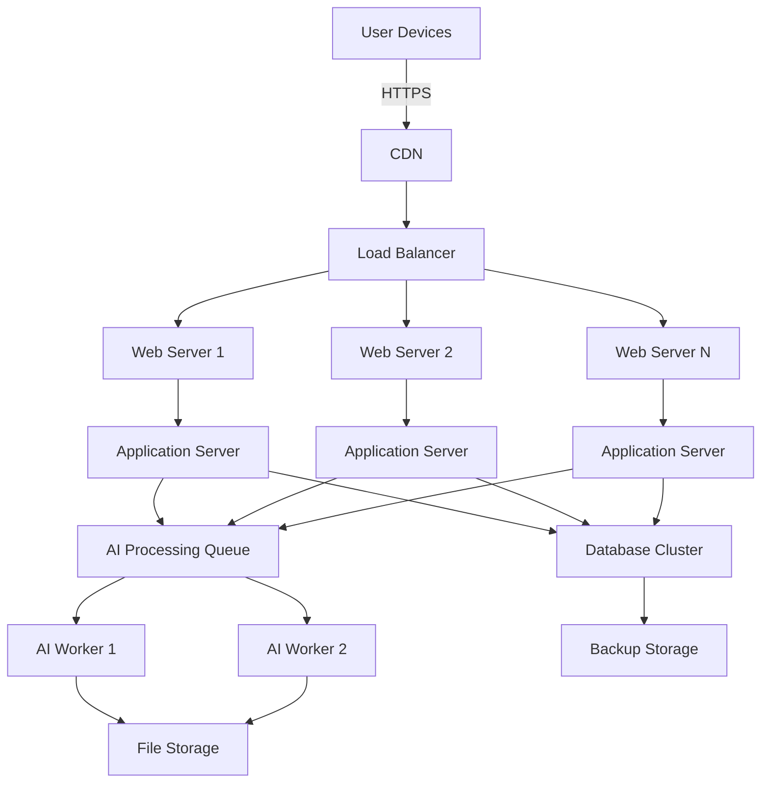
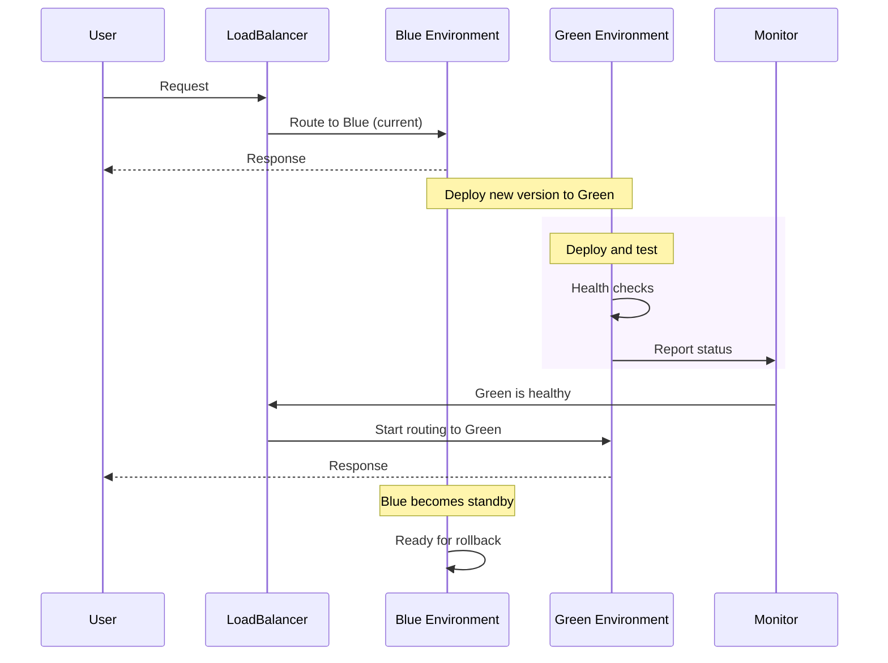
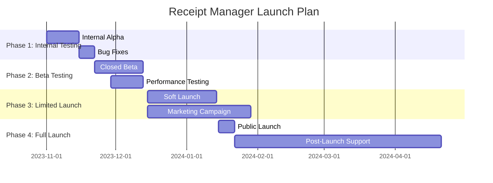

# Deployment and Launch Plan

## 1. Deployment Architecture

### Production Environment Diagram


### Environment Configuration
```yaml
# Production environment configuration
production:
  app:
    port: 3000
    host: 0.0.0.0
    environment: production
    log_level: info
    session_secret: ${SESSION_SECRET}
    jwt_secret: ${JWT_SECRET}

  database:
    host: ${DB_HOST}
    port: 5432
    name: receipt_manager_prod
    user: ${DB_USER}
    password: ${DB_PASSWORD}
    pool:
      min: 5
      max: 20
      idle_timeout: 30000

  storage:
    provider: s3
    bucket: receipt-manager-prod
    region: us-east-1
    access_key: ${S3_ACCESS_KEY}
    secret_key: ${S3_SECRET_KEY}

  ai:
    model_path: /models/receipt-processor-v1.2
    workers: 4
    batch_size: 8
    timeout: 30000

  monitoring:
    prometheus:
      enabled: true
      port: 9090
    logging:
      level: info
      file: /var/log/receipt-manager/app.log
      max_size: 100m
      max_files: 7
```

## 2. Deployment Strategy

### Blue-Green Deployment


### Rollback Procedure
```bash
#!/bin/bash
# Rollback script

# Check current active environment
CURRENT_ENV=$(get_active_environment)

if [ "$CURRENT_ENV" = "green" ]; then
  TARGET_ENV="blue"
else
  TARGET_ENV="green"
fi

echo "Initiating rollback from $CURRENT_ENV to $TARGET_ENV"

# Step 1: Verify target environment is healthy
if ! verify_environment_health $TARGET_ENV; then
  echo "Target environment $TARGET_ENV is not healthy. Aborting rollback."
  exit 1
fi

# Step 2: Update load balancer configuration
echo "Updating load balancer to route to $TARGET_ENV"
update_load_balancer $TARGET_ENV

# Step 3: Monitor traffic
echo "Monitoring traffic for 2 minutes..."
if monitor_traffic 120; then
  echo "Rollback successful"
else
  echo "Rollback failed. Traffic issues detected."
  # Attempt to revert
  update_load_balancer $CURRENT_ENV
  exit 1
fi

# Step 4: Investigate failed environment
echo "Analyzing $CURRENT_ENV environment..."
generate_diagnostics $CURRENT_ENV
```

## 3. Infrastructure as Code

### Terraform Configuration
```hcl
# main.tf - AWS Infrastructure
provider "aws" {
  region = "us-east-1"
}

resource "aws_vpc" "main" {
  cidr_block = "10.0.0.0/16"
  enable_dns_support = true
  enable_dns_hostnames = true
  tags = {
    Name = "receipt-manager-vpc"
  }
}

resource "aws_subnet" "public" {
  count = 2
  vpc_id     = aws_vpc.main.id
  cidr_block = "10.0.${count.index}.0/24"
  availability_zone = element(["us-east-1a", "us-east-1b"], count.index)
  map_public_ip_on_launch = true
  tags = {
    Name = "receipt-manager-public-${count.index}"
  }
}

resource "aws_rds_cluster" "database" {
  cluster_identifier      = "receipt-manager-db"
  engine                  = "aurora-postgresql"
  engine_version          = "13.6"
  database_name           = "receiptmanager"
  master_username         = "admin"
  master_password         = var.db_password
  backup_retention_period = 7
  preferred_backup_window = "07:00-09:00"
  skip_final_snapshot     = false
  final_snapshot_identifier = "receipt-manager-final-snapshot"
}

resource "aws_ecs_cluster" "app_cluster" {
  name = "receipt-manager-cluster"
}

resource "aws_ecs_service" "web_service" {
  name            = "receipt-manager-web"
  cluster         = aws_ecs_cluster.app_cluster.id
  task_definition = aws_ecs_task_definition.web.arn
  desired_count   = 3
  launch_type     = "FARGATE"

  load_balancer {
    target_group_arn = aws_lb_target_group.web.arn
    container_name   = "receipt-manager-web"
    container_port   = 3000
  }

  depends_on = [aws_lb_listener.web]
}
```

### Docker Configuration
```dockerfile
# Dockerfile for web application
FROM node:16-alpine as builder

WORKDIR /app

# Install dependencies
COPY package*.json ./
RUN npm ci

# Build application
COPY . .
RUN npm run build

# Production image
FROM node:16-alpine

WORKDIR /app

# Copy built files
COPY --from=builder /app/dist ./dist
COPY --from=builder /app/node_modules ./node_modules
COPY --from=builder /app/package*.json ./

# Install only production dependencies
RUN npm ci --only=production

# Configuration
COPY config/production.json ./config.json

# Health check
HEALTHCHECK --interval=30s --timeout=3s \
  CMD curl -f http://localhost:3000/health || exit 1

EXPOSE 3000

CMD ["node", "dist/server.js"]
```

## 4. CI/CD Pipeline

### GitHub Actions Workflow
```yaml
# .github/workflows/deploy.yml
name: Deployment Pipeline

on:
  push:
    branches: [ main ]
  workflow_dispatch:

env:
  AWS_REGION: us-east-1
  ECR_REPOSITORY: receipt-manager
  ECS_SERVICE: receipt-manager-service
  ECS_CLUSTER: receipt-manager-cluster
  ECS_TASK_DEFINITION: .aws/task-definition.json

jobs:
  build-and-deploy:
    name: Build and Deploy
    runs-on: ubuntu-latest

    steps:
    - name: Checkout
      uses: actions/checkout@v2

    - name: Configure AWS credentials
      uses: aws-actions/configure-aws-credentials@v1
      with:
        aws-access-key-id: ${{ secrets.AWS_ACCESS_KEY_ID }}
        aws-secret-access-key: ${{ secrets.AWS_SECRET_ACCESS_KEY }}
        aws-region: ${{ env.AWS_REGION }}

    - name: Login to Amazon ECR
      id: login-ecr
      uses: aws-actions/amazon-ecr-login@v1

    - name: Build, tag, and push image to Amazon ECR
      id: build-image
      env:
        ECR_REGISTRY: ${{ steps.login-ecr.outputs.registry }}
        IMAGE_TAG: ${{ github.sha }}
      run: |
        docker build -t $ECR_REGISTRY/$ECR_REPOSITORY:$IMAGE_TAG .
        docker push $ECR_REGISTRY/$ECR_REPOSITORY:$IMAGE_TAG
        echo "::set-output name=image::$ECR_REGISTRY/$ECR_REPOSITORY:$IMAGE_TAG"

    - name: Fill in the new image ID in the Amazon ECS task definition
      id: task-def
      uses: aws-actions/amazon-ecs-render-task-definition@v1
      with:
        task-definition: ${{ env.ECS_TASK_DEFINITION }}
        container-name: receipt-manager-web
        image: ${{ steps.build-image.outputs.image }}

    - name: Deploy Amazon ECS task definition
      uses: aws-actions/amazon-ecs-deploy-task-definition@v1
      with:
        task-definition: ${{ steps.task-def.outputs.task-definition }}
        service: ${{ env.ECS_SERVICE }}
        cluster: ${{ env.ECS_CLUSTER }}
        wait-for-service-stability: true
```

### Deployment Checklist
```markdown
## Pre-Deployment Checklist

- [ ] Database backups verified
- [ ] All tests passing in CI
- [ ] Security scans completed
- [ ] Performance tests passed
- [ ] Rollback plan documented
- [ ] Monitoring alerts configured
- [ ] Team notified of deployment window

## Deployment Steps

1. **Database Migration**
   - Run schema migrations
   - Verify data integrity
   - Update connection strings

2. **Backend Deployment**
   - Deploy API services
   - Verify health checks
   - Test critical endpoints

3. **Frontend Deployment**
   - Deploy static assets
   - Clear CDN cache
   - Verify asset loading

4. **AI Model Deployment**
   - Deploy updated models
   - Verify model loading
   - Test inference endpoints

5. **Monitoring Setup**
   - Configure alerts
   - Set up dashboards
   - Verify logging

## Post-Deployment Verification

- [ ] Smoke tests passing
- [ ] Performance metrics normal
- [ ] Error rates within thresholds
- [ ] User authentication working
- [ ] Receipt processing functional
- [ ] Backup systems operational
```

## 5. Launch Plan

### Phased Rollout Strategy


### Marketing Materials
```markdown
# Receipt Manager - Launch Announcement

## Key Messaging

**Headline**: "Transform Your Receipt Management with AI Power"

**Subhead**: "Scan, Organize, and Analyze Your Business Receipts Automatically"

## Features to Highlight

✅ **Instant Receipt Scanning** - Snap a photo, get organized data
✅ **AI-Powered Extraction** - Automatic data entry with 95%+ accuracy
✅ **Smart Analytics** - Track spending patterns and trends
✅ **Secure Storage** - All your financial records in one place
✅ **Mobile-Friendly** - Works on any device, anywhere

## Target Audience

- Small business owners (restaurants, retail, services)
- Freelancers and consultants
- Non-profit organizations
- Home-based businesses

## Launch Timeline

**Week 1-2**: Early access for beta testers
**Week 3-4**: Limited public launch with waitlist
**Week 5+**: Full public availability

## Pricing Strategy

| Plan | Price | Features |
|------|-------|----------|
| Starter | Free | 50 receipts/month, Basic analytics |
| Pro | $19/month | 500 receipts/month, Advanced analytics |
| Business | $49/month | Unlimited receipts, Team access |
| Enterprise | Custom | API access, Custom integrations |
```

### Customer Support Plan
```javascript
// Support ticket system configuration
const supportConfig = {
  channels: [
    {
      type: 'email',
      address: 'support@receiptmanager.com',
      responseTime: '24 hours',
      priority: 'medium'
    },
    {
      type: 'chat',
      provider: 'intercom',
      responseTime: '2 hours',
      priority: 'high',
      businessHours: '9AM-5PM UTC'
    },
    {
      type: 'phone',
      number: '+1-800-RECEIPT',
      responseTime: 'Immediate',
      priority: 'critical',
      hours: '24/7'
    }
  ],

  sla: {
    critical: '1 hour response',
    high: '4 hour response',
    medium: '24 hour response',
    low: '48 hour response'
  },

  knowledgeBase: {
    categories: [
      'Getting Started',
      'Scanning Receipts',
      'Managing Data',
      'Troubleshooting',
      'Billing'
    ],
    initialArticles: 50,
    updateFrequency: 'weekly'
  },

  onboarding: {
    emailSequence: [
      'Welcome Email',
      'Quick Start Guide',
      'First Receipt Scan',
      'Advanced Features',
      'Feedback Request'
    ],
    inAppTutorials: [
      'Account Setup',
      'First Scan',
      'Dashboard Tour',
      'Analytics Overview'
    ]
  }
};
```

## 6. Monitoring and Maintenance

### Production Monitoring Setup
```javascript
// Monitoring configuration
const monitoringConfig = {
  metrics: {
    responseTime: {
      threshold: 500, // ms
      alertAfter: 3 // consecutive violations
    },
    errorRate: {
      threshold: 0.01, // 1%
      alertAfter: 1
    },
    cpuUsage: {
      threshold: 0.8, // 80%
      alertAfter: 2
    },
    memoryUsage: {
      threshold: 0.85, // 85%
      alertAfter: 2
    }
  },

  alerts: {
    critical: [
      {
        name: 'ServiceDown',
        condition: 'noResponseFor > 1m',
        notification: ['email', 'sms', 'pager'],
        escalation: 'immediate'
      },
      {
        name: 'DatabaseFailure',
        condition: 'dbConnectionFailed > 3 in 5m',
        notification: ['email', 'pager'],
        escalation: 'immediate'
      }
    ],
    warning: [
      {
        name: 'HighErrorRate',
        condition: 'errorRate > 0.05 for 10m',
        notification: ['email', 'slack'],
        escalation: '1h'
      },
      {
        name: 'SlowResponse',
        condition: 'avgResponseTime > 1000 for 15m',
        notification: ['slack'],
        escalation: '2h'
      }
    ]
  },

  logging: {
    retention: {
      debug: '7d',
      info: '30d',
      warn: '60d',
      error: '90d'
    },
    destinations: [
      'aws-cloudwatch',
      'elastic-search',
      'local-files'
    ]
  }
};
```

### Maintenance Schedule
```markdown
## Regular Maintenance Schedule

### Weekly Tasks (Every Monday 2AM UTC)
- Database backups verification
- Log rotation and cleanup
- System health checks
- Security patch updates

### Monthly Tasks (First Sunday of month)
- Database optimization
- Performance benchmarking
- Dependency updates
- Security vulnerability scans

### Quarterly Tasks
- Major version updates
- Capacity planning review
- Disaster recovery testing
- Architecture review

### Annual Tasks
- Full security audit
- Compliance certification
- Major infrastructure review
- Technology stack evaluation
```

## 7. Success Metrics

### Key Performance Indicators
```javascript
const kpiTargets = {
  // User Acquisition
  signupConversionRate: 0.45, // 45% of visitors sign up
  activationRate: 0.75,        // 75% of signups scan first receipt

  // Engagement
  weeklyActiveUsers: 0.6,      // 60% of users active weekly
  monthlyActiveUsers: 0.8,    // 80% of users active monthly
  avgSessionsPerUser: 4,       // 4 sessions per user per week

  // Retention
  day30Retention: 0.5,         // 50% of users return after 30 days
  day90Retention: 0.35,       // 35% of users return after 90 days

  // Performance
  avgResponseTime: 300,        // 300ms average response time
  uptime: 0.999,               // 99.9% uptime
  processingAccuracy: 0.95,   // 95% data extraction accuracy

  // Business
  mrr: 50000,                 // $50,000 Monthly Recurring Revenue
  customerSatisfaction: 4.5, // 4.5/5 average satisfaction score
  netPromoterScore: 50        // NPS of 50+
};
```

### Launch Success Criteria
```markdown
## Launch Success Criteria

### Technical Success
- [ ] 99.9% uptime during first 30 days
- [ ] <1% error rate on critical paths
- [ ] Average response time <500ms
- [ ] Database performance within thresholds
- [ ] AI processing accuracy >90%

### Business Success
- [ ] 1,000+ active users within first month
- [ ] 25% conversion rate from free to paid
- [ ] $10,000+ MRR within first quarter
- [ ] 4.0+ average app store rating
- [ ] 80%+ customer satisfaction score

### Operational Success
- [ ] <24 hour response time for support tickets
- [ ] <5% churn rate in first 90 days
- [ ] Successful completion of disaster recovery test
- [ ] All monitoring and alerting functional
- [ ] Documentation complete and accessible
```

## 8. Post-Launch Activities

### Continuous Improvement Plan
```javascript
const improvementRoadmap = {
  shortTerm: [
    {
      initiative: 'Mobile App Development',
      timeline: 'Q2 2024',
      impact: 'Improve user experience on mobile devices'
    },
    {
      initiative: 'Multi-Language Support',
      timeline: 'Q1 2024',
      impact: 'Expand to international markets'
    },
    {
      initiative: 'Advanced Analytics',
      timeline: 'Q2 2024',
      impact: 'Provide deeper business insights'
    }
  ],

  mediumTerm: [
    {
      initiative: 'Accounting Software Integration',
      timeline: 'Q3 2024',
      impact: 'Seamless workflow with existing tools'
    },
    {
      initiative: 'Expense Reporting',
      timeline: 'Q4 2024',
      impact: 'Automated expense management'
    },
    {
      initiative: 'Team Collaboration Features',
      timeline: 'Q3 2024',
      impact: 'Support multi-user businesses'
    }
  ],

  longTerm: [
    {
      initiative: 'AI Model Improvements',
      timeline: 'Ongoing',
      impact: 'Increase accuracy and support more receipt types'
    },
    {
      initiative: 'Enterprise Features',
      timeline: '2025',
      impact: 'Support larger business customers'
    },
    {
      initiative: 'Global Expansion',
      timeline: '2025-2026',
      impact: 'Localized versions for key markets'
    }
  ]
};
```

### Customer Feedback System
```markdown
## Customer Feedback Collection

### Feedback Channels
- **In-App Feedback**: Quick rating system after key actions
- **Email Surveys**: Quarterly satisfaction surveys
- **User Interviews**: Monthly interviews with power users
- **Support Tickets**: Analysis of common issues and requests
- **App Store Reviews**: Monitoring and response system

### Feedback Processing
1. **Collection**: Gather feedback from all channels
2. **Categorization**: Organize by feature, usability, performance, etc.
3. **Prioritization**: Score based on impact and feasibility
4. **Implementation**: Add to product roadmap
5. **Communication**: Update users on status

### Feedback Response SLA
- **Critical Issues**: 24 hour response
- **Feature Requests**: 7 day acknowledgment
- **General Feedback**: 14 day review
- **Implementation Updates**: Monthly newsletter
```

## 9. Legal and Compliance

### Data Protection Measures
```markdown
## Data Protection and Compliance

### Security Measures
- End-to-end encryption for data in transit
- AES-256 encryption for data at rest
- Regular security audits and penetration testing
- Role-based access control
- Comprehensive audit logging

### Compliance Standards
- **GDPR**: Full compliance for EU users
- **CCPA**: California consumer privacy compliance
- **PCI DSS**: Payment data security standards
- **HIPAA**: Healthcare data protection (if applicable)
- **SOC 2**: Service organization controls

### Data Retention Policy
- User account data: Retained until account deletion
- Receipt images: 7 years (tax compliance)
- Processed data: Permanent (for analytics)
- Audit logs: 2 years
- Backup retention: 30 days daily, 1 year monthly
```

### Terms of Service Highlights
```markdown
## Key Terms of Service

### User Responsibilities
- Maintain confidentiality of account credentials
- Ensure compliance with local tax laws
- Regular data backup (though we provide backups)
- Accurate business information

### Service Guarantees
- 99.9% uptime SLA
- 24/7 monitoring and support
- Regular security updates
- Data portability and export

### Limitations
- Fair usage policy for free tier
- Reasonable API rate limits
- Acceptable use policy
- Prohibited content types
```

## 10. Final Launch Checklist

### Go/No-Go Criteria
```markdown
## Final Launch Checklist

### Technical Readiness
- [ ] All critical bugs resolved
- [ ] Performance benchmarks met
- [ ] Security audit completed
- [ ] Backup and recovery tested
- [ ] Monitoring and alerting configured

### Business Readiness
- [ ] Pricing and billing system tested
- [ ] Customer support team trained
- [ ] Marketing materials finalized
- [ ] Sales team prepared
- [ ] Partner integrations working

### Operational Readiness
- [ ] Documentation complete
- [ ] Training materials available
- [ ] Incident response plan documented
- [ ] Communication channels established
- [ ] Post-launch support scheduled

### Final Approval
- [ ] Executive sign-off obtained
- [ ] Legal review completed
- [ ] Compliance certification verified
- [ ] Final security scan passed
- [ ] Launch announcement prepared
```

### Launch Day Timeline
```markdown
## Launch Day Schedule (All times UTC)

**06:00 - 07:00**: Final system checks
- Database verification
- Service health checks
- Load testing

**07:00 - 07:30**: Final deployment
- Code deployment
- Configuration updates
- Cache clearing

**07:30 - 08:00**: Smoke testing
- Critical path verification
- User journey testing
- Performance monitoring

**08:00**: **LAUNCH**
- Open to public
- Enable signups
- Start monitoring

**08:00 - 09:00**: Initial monitoring
- Watch error rates
- Monitor performance
- Check user flows

**09:00**: Launch announcement
- Press release
- Social media blast
- Email campaign

**09:00 - 17:00**: Active support
- Monitor support channels
- Quick response to issues
- Real-time adjustments

**17:00**: End-of-day review
- Performance analysis
- Issue triage
- Plan for day 2