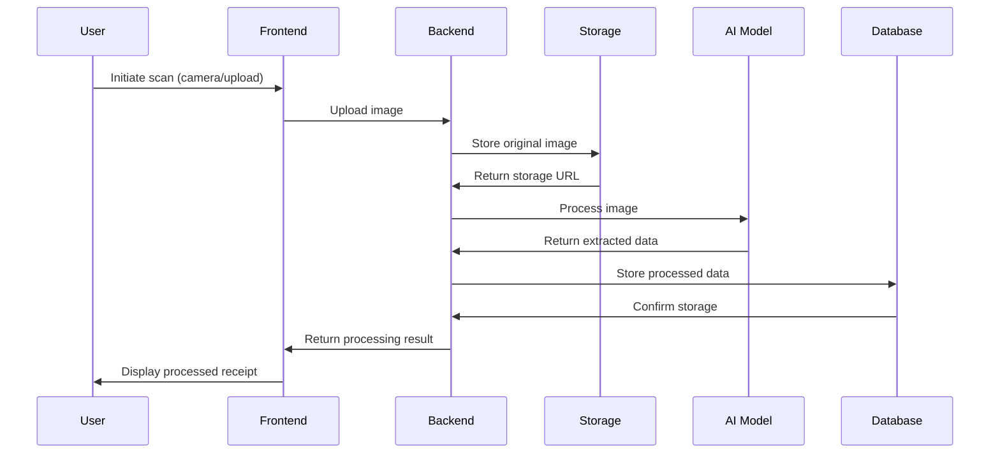

# Receipt Scanning Implementation

## 1. Scanning Workflow

### Complete Scanning Process


### Frontend Scanning Component
```jsx
const ReceiptScanner = () => {
  const [scanMethod, setScanMethod] = useState('camera'); // 'camera' or 'upload'
  const [isProcessing, setIsProcessing] = useState(false);
  const [progress, setProgress] = useState(0);
  const [error, setError] = useState(null);
  const [result, setResult] = useState(null);

  const handleScan = async (imageData) => {
    try {
      setIsProcessing(true);
      setProgress(0);
      setError(null);

      // Upload to server
      const formData = new FormData();
      formData.append('file', imageData);
      formData.append('business_id', currentUser.businessId);

      const response = await api.post('/api/receipts/upload', formData, {
        onUploadProgress: (progressEvent) => {
          const percentCompleted = Math.round(
            (progressEvent.loaded * 100) / progressEvent.total
          );
          setProgress(percentCompleted);
        }
      });

      // Poll for processing status
      const receiptId = response.data.receipt_id;
      const statusResponse = await pollProcessingStatus(receiptId);

      setResult(statusResponse.data);
      setIsProcessing(false);

    } catch (err) {
      setError(err.response?.data?.error || 'Processing failed');
      setIsProcessing(false);
    }
  };

  const pollProcessingStatus = async (receiptId) => {
    return new Promise((resolve, reject) => {
      const interval = setInterval(async () => {
        try {
          const response = await api.get(`/api/receipts/${receiptId}/status`);
          const status = response.data.status;

          if (status === 'completed') {
            clearInterval(interval);
            resolve(response);
          } else if (status === 'failed') {
            clearInterval(interval);
            reject(new Error('Processing failed'));
          }
        } catch (error) {
          clearInterval(interval);
          reject(error);
        }
      }, 2000); // Poll every 2 seconds
    });
  };

  return (
    <ScannerContainer>
      <MethodSelector
        method={scanMethod}
        onMethodChange={setScanMethod}
      />

      {scanMethod === 'camera' ? (
        <CameraScanner onCapture={handleScan} />
      ) : (
        <FileUploader onFileSelect={handleScan} />
      )}

      {isProcessing && (
        <ProcessingOverlay>
          <ProgressBar value={progress} />
          <ProcessingStatus>
            {progress < 100 ? 'Processing receipt...' : 'Finalizing...'}
          </ProcessingStatus>
        </ProcessingOverlay>
      )}

      {error && <ErrorMessage message={error} onDismiss={() => setError(null)} />}

      {result && (
        <ScanResultPreview
          receipt={result}
          onSave={() => navigate(`/receipts/${result.receipt_id}`)}
          onRetry={() => setResult(null)}
        />
      )}
    </ScannerContainer>
  );
};
```

## 2. Camera Integration

### Mobile Camera Access
```jsx
const CameraScanner = ({ onCapture }) => {
  const videoRef = useRef(null);
  const canvasRef = useRef(null);
  const [cameraError, setCameraError] = useState(null);
  const [isCameraReady, setIsCameraReady] = useState(false);

  useEffect(() => {
    const initCamera = async () => {
      try {
        const stream = await navigator.mediaDevices.getUserMedia({
          video: {
            facingMode: 'environment',
            width: { ideal: 1920 },
            height: { ideal: 1080 }
          },
          audio: false
        });

        if (videoRef.current) {
          videoRef.current.srcObject = stream;
          videoRef.current.play();
          setIsCameraReady(true);
        }
      } catch (err) {
        setCameraError('Camera access denied. Please enable camera permissions.');
        console.error('Camera error:', err);
      }
    };

    initCamera();

    return () => {
      if (videoRef.current?.srcObject) {
        videoRef.current.srcObject.getTracks().forEach(track => track.stop());
      }
    };
  }, []);

  const captureImage = () => {
    if (!videoRef.current || !canvasRef.current) return;

    const video = videoRef.current;
    const canvas = canvasRef.current;

    // Set canvas dimensions to match video
    canvas.width = video.videoWidth;
    canvas.height = video.videoHeight;

    const ctx = canvas.getContext('2d');
    ctx.drawImage(video, 0, 0, canvas.width, canvas.height);

    // Convert to blob and trigger capture
    canvas.toBlob((blob) => {
      if (blob) {
        const file = new File([blob], 'receipt.jpg', { type: 'image/jpeg' });
        onCapture(file);
      }
    }, 'image/jpeg', 0.9);
  };

  return (
    <CameraContainer>
      {!isCameraReady ? (
        <CameraLoading>
          {cameraError || 'Initializing camera...'}
        </CameraLoading>
      ) : (
        <>
          <VideoPreview ref={videoRef} />
          <CaptureOverlay />
          <CaptureButton onClick={captureImage} />
        </>
      )}
      <canvas ref={canvasRef} style={{ display: 'none' }} />
    </CameraContainer>
  );
};
```

### Camera Permission Handling
```javascript
// Check and request camera permissions
async function checkCameraPermissions() {
  try {
    // Check if permission was already granted
    const permissionStatus = await navigator.permissions.query({
      name: 'camera'
    });

    if (permissionStatus.state === 'granted') {
      return true;
    }

    // Request permission by trying to access camera
    const stream = await navigator.mediaDevices.getUserMedia({
      video: true,
      audio: false
    });

    // Clean up
    stream.getTracks().forEach(track => track.stop());
    return true;

  } catch (error) {
    console.error('Camera permission error:', error);
    return false;
  }
}

// Handle permission denied state
function handlePermissionDenied() {
  return (
    <PermissionDenied>
      <h3>Camera Access Required</h3>
      <p>To scan receipts, please enable camera access in your browser settings.</p>
      <Button onClick={() => window.open('about:settings', '_blank')}>
        Open Settings
      </Button>
      <AlternativeMethod>
        Or <span onClick={() => setScanMethod('upload')}>upload a file</span>
      </AlternativeMethod>
    </PermissionDenied>
  );
}
```

## 3. File Upload Handling

### Drag and Drop Uploader
```jsx
const FileUploader = ({ onFileSelect }) => {
  const [dragActive, setDragActive] = useState(false);
  const [fileError, setFileError] = useState(null);
  const fileInputRef = useRef(null);

  const handleDrag = (e) => {
    e.preventDefault();
    e.stopPropagation();
    if (e.type === 'dragenter' || e.type === 'dragover') {
      setDragActive(true);
    } else if (e.type === 'dragleave') {
      setDragActive(false);
    }
  };

  const handleDrop = (e) => {
    e.preventDefault();
    e.stopPropagation();
    setDragActive(false);

    if (e.dataTransfer.files && e.dataTransfer.files[0]) {
      handleFile(e.dataTransfer.files[0]);
    }
  };

  const handleFileChange = (e) => {
    if (e.target.files && e.target.files[0]) {
      handleFile(e.target.files[0]);
    }
  };

  const handleFile = (file) => {
    setFileError(null);

    // Validate file
    if (!isValidFile(file)) {
      setFileError('Invalid file type. Please upload JPEG, PNG, or PDF.');
      return;
    }

    if (file.size > 5 * 1024 * 1024) { // 5MB limit
      setFileError('File too large. Maximum size is 5MB.');
      return;
    }

    // Process file
    onFileSelect(file);
  };

  const isValidFile = (file) => {
    const validTypes = ['image/jpeg', 'image/png', 'application/pdf'];
    return validTypes.includes(file.type);
  };

  const triggerFileInput = () => {
    fileInputRef.current.click();
  };

  return (
    <UploadContainer
      onDragEnter={handleDrag}
      onDragLeave={handleDrag}
      onDragOver={handleDrag}
      onDrop={handleDrop}
      dragActive={dragActive}
    >
      <input
        type="file"
        ref={fileInputRef}
        onChange={handleFileChange}
        accept=".jpg,.jpeg,.png,.pdf"
        style={{ display: 'none' }}
      />

      <UploadArea>
        <CloudUploadIcon />
        <h3>Upload Receipt</h3>
        <p>Drag and drop files here or</p>
        <UploadButton onClick={triggerFileInput}>
          Browse Files
        </UploadButton>
        <FileRequirements>
          Supported formats: JPEG, PNG, PDF (Max 5MB)
        </FileRequirements>
      </UploadArea>

      {fileError && <ErrorMessage message={fileError} />}
    </UploadContainer>
  );
};
```

## 4. Image Processing Pipeline

### Backend Processing Service
```javascript
// Receipt processing service
class ReceiptProcessingService {
  constructor() {
    this.storageService = new StorageService();
    this.aiModel = new ReceiptAIModel();
    this.database = new DatabaseService();
  }

  async processReceipt(file, businessId, userId) {
    try {
      // Step 1: Validate and store original file
      const validationResult = this._validateFile(file);
      if (!validationResult.valid) {
        throw new Error(validationResult.message);
      }

      const storagePath = await this.storageService.storeFile(
        file,
        `businesses/${businessId}/receipts/original`
      );

      // Step 2: Create database record
      const receiptRecord = await this.database.createReceipt({
        business_id: businessId,
        original_filename: file.originalname,
        storage_path: storagePath,
        status: 'uploaded',
        uploaded_by: userId
      });

      // Step 3: Process with AI model
      const processingResult = await this.aiModel.processReceipt(
        storagePath,
        receiptRecord.receipt_id
      );

      // Step 4: Update with extracted data
      await this.database.updateReceipt(receiptRecord.receipt_id, {
        ...processingResult,
        status: 'processed'
      });

      return {
        success: true,
        receiptId: receiptRecord.receipt_id,
        data: processingResult
      };

    } catch (error) {
      console.error('Processing error:', error);
      await this._handleProcessingError(receiptRecord?.receipt_id, error);
      throw error;
    }
  }

  _validateFile(file) {
    const validTypes = ['image/jpeg', 'image/png', 'application/pdf'];
    const maxSize = 5 * 1024 * 1024; // 5MB

    if (!validTypes.includes(file.mimetype)) {
      return {
        valid: false,
        message: 'Invalid file type. Only JPEG, PNG, and PDF are supported.'
      };
    }

    if (file.size > maxSize) {
      return {
        valid: false,
        message: 'File too large. Maximum size is 5MB.'
      };
    }

    return { valid: true };
  }

  async _handleProcessingError(receiptId, error) {
    if (receiptId) {
      await this.database.updateReceipt(receiptId, {
        status: 'failed',
        error_message: error.message
      });
    }
  }
}
```

## 5. Error Handling and Recovery

### Comprehensive Error Handling
```javascript
// Error handling middleware
function errorHandler(err, req, res, next) {
  console.error('Processing error:', err);

  // Handle specific error types
  if (err instanceof multer.MulterError) {
    // File upload errors
    return res.status(400).json({
      error: {
        code: 'UPLOAD_ERROR',
        message: err.message,
        details: getUploadErrorDetails(err.code)
      }
    });
  }

  if (err.name === 'ValidationError') {
    // Data validation errors
    return res.status(400).json({
      error: {
        code: 'VALIDATION_ERROR',
        message: 'Invalid data format',
        details: err.details
      }
    });
  }

  if (err.code === 'STORAGE_ERROR') {
    // Storage related errors
    return res.status(500).json({
      error: {
        code: 'STORAGE_ERROR',
        message: 'Failed to store receipt',
        retryable: true
      }
    });
  }

  if (err.code === 'AI_PROCESSING_ERROR') {
    // AI processing errors
    return res.status(500).json({
      error: {
        code: 'PROCESSING_ERROR',
        message: 'Failed to process receipt',
        retryable: true,
        suggestion: 'Try uploading a clearer image'
      }
    });
  }

  // Generic error
  res.status(500).json({
    error: {
      code: 'INTERNAL_ERROR',
      message: 'An unexpected error occurred',
      reference: err.referenceId
    }
  });
}

// Upload error details mapping
function getUploadErrorDetails(errorCode) {
  const errorMap = {
    'LIMIT_FILE_SIZE': 'File exceeds maximum size limit (5MB)',
    'LIMIT_FILE_COUNT': 'Too many files uploaded',
    'LIMIT_UNEXPECTED_FILE': 'Unexpected file type',
    'LIMIT_FILE_TYPE': 'File type not allowed'
  };

  return errorMap[errorCode] || 'File upload failed';
}
```

### Retry Mechanism
```javascript
// Frontend retry logic
const useRetryLogic = (initialDelay = 2000, maxRetries = 3) => {
  const [retryCount, setRetryCount] = useState(0);
  const [delay, setDelay] = useState(initialDelay);

  const retry = useCallback(async (action) => {
    if (retryCount >= maxRetries) {
      throw new Error('Max retries exceeded');
    }

    try {
      const result = await action();
      setRetryCount(0); // Reset on success
      return result;
    } catch (error) {
      const newRetryCount = retryCount + 1;
      setRetryCount(newRetryCount);

      // Exponential backoff
      const newDelay = initialDelay * Math.pow(2, newRetryCount);
      setDelay(newDelay);

      if (newRetryCount >= maxRetries) {
        throw error;
      }

      // Wait before retrying
      await new Promise(resolve => setTimeout(resolve, delay));

      // Retry the action
      return retry(action);
    }
  }, [retryCount, delay, initialDelay, maxRetries]);

  return { retry, retryCount, delay };
};
```

## 6. Performance Optimization

### Image Optimization
```javascript
// Image preprocessing for better OCR results
async function optimizeImageForOCR(imagePath) {
  try {
    // Load image
    const image = await Jimp.read(imagePath);

    // Convert to grayscale
    image.grayscale();

    // Increase contrast
    image.contrast(0.2);

    // Apply threshold
    image.threshold({ max: 200 });

    // Resize if too large
    if (image.bitmap.width > 2000) {
      image.resize(2000, Jimp.AUTO);
    }

    // Save optimized version
    const optimizedPath = imagePath.replace(/\.(\w+)$/, '_optimized.$1');
    await image.writeAsync(optimizedPath);

    return optimizedPath;

  } catch (error) {
    console.error('Image optimization failed:', error);
    return imagePath; // Return original if optimization fails
  }
}
```

### Batch Processing
```javascript
// Batch processing for multiple receipts
class BatchProcessor {
  constructor() {
    this.queue = [];
    this.isProcessing = false;
    this.maxConcurrent = 3;
  }

  addToQueue(job) {
    this.queue.push(job);
    this._processQueue();
  }

  async _processQueue() {
    if (this.isProcessing || this.queue.length === 0) return;

    this.isProcessing = true;

    try {
      // Process up to maxConcurrent jobs
      const batch = this.queue.slice(0, this.maxConcurrent);
      this.queue = this.queue.slice(this.maxConcurrent);

      await Promise.all(
        batch.map(job => this._processJob(job))
      );

    } catch (error) {
      console.error('Batch processing error:', error);
    } finally {
      this.isProcessing = false;
      // Process remaining items
      if (this.queue.length > 0) {
        this._processQueue();
      }
    }
  }

  async _processJob(job) {
    try {
      const result = await job.processor(job.data);
      job.onSuccess(result);
    } catch (error) {
      job.onError(error);
    }
  }
}