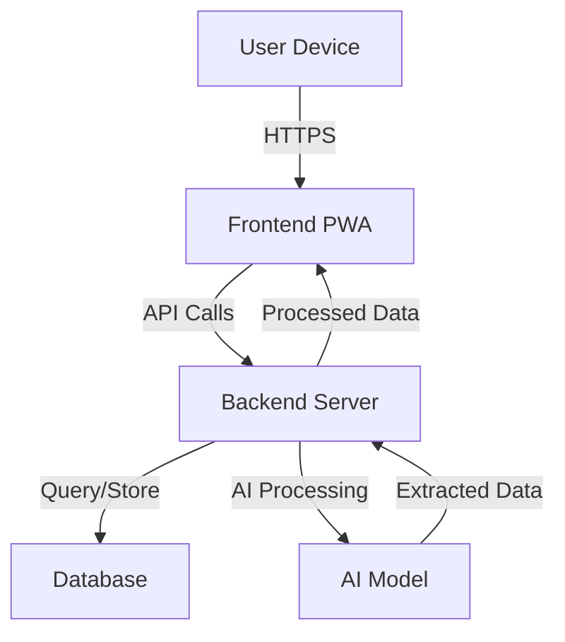
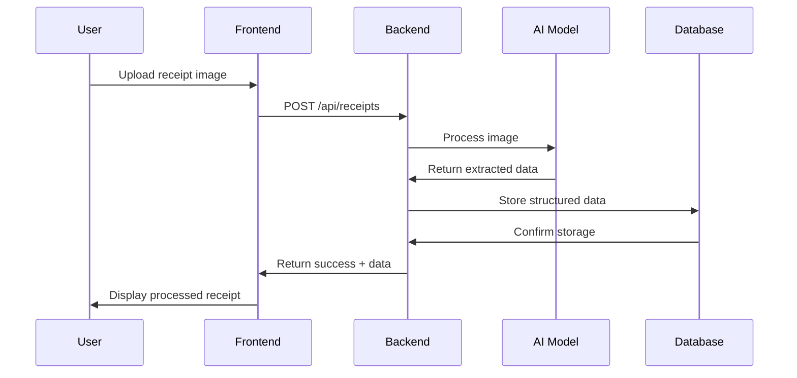

# System Architecture for AI-Powered Receipt Management

## 1. High-Level Architecture

## 2. Component Breakdown

### Frontend (PWA)
- **Technology**: React.js with Material-UI
- **Features**:
  - Responsive design for mobile/desktop
  - Camera access for receipt scanning
  - File upload interface
  - Data visualization dashboard
  - User authentication flows

### Backend Server
- **Technology**: Node.js with Express
- **Features**:
  - RESTful API endpoints
  - Authentication middleware
  - File processing pipeline
  - Database ORM
  - AI model integration

### Database
- **Technology**: PostgreSQL (relational for structured data)
- **Schema**:
  - Users table
  - Businesses table
  - Receipts table
  - ReceiptItems table
  - Audit logs

### AI Model
- **Technology**: Python-based OCR + NLP
- **Features**:
  - Receipt image preprocessing
  - Text extraction (OCR)
  - Data field identification
  - Validation and correction
  - Confidence scoring

## 3. Data Flow

## 4. Security Considerations
- End-to-end encryption for data in transit
- Role-based access control
- Secure file storage with access controls
- Regular security audits
- GDPR compliance for user data

## 5. Scalability Approach
- Containerized microservices
- Horizontal scaling for AI processing
- Database read replicas
- CDN for static assets
- Caching layer for frequent queries