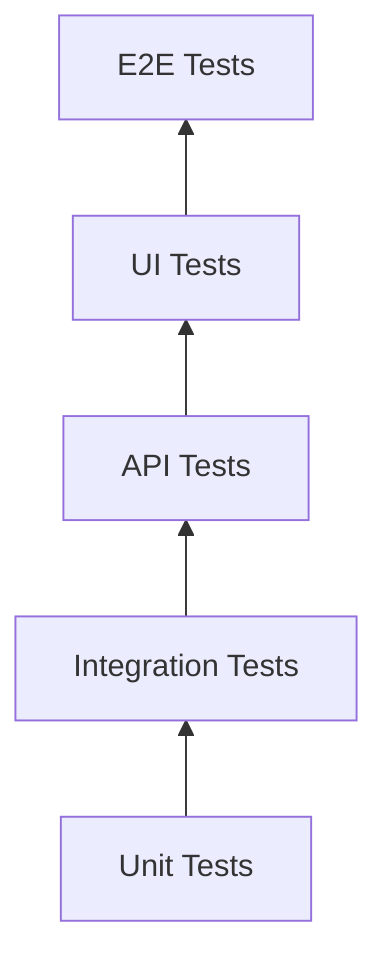

# Testing Strategy for Receipt Management System

## 1. Testing Approach

### Testing Pyramid


### Test Coverage Goals
- **Unit Tests**: 80%+ code coverage
- **Integration Tests**: Critical path coverage
- **API Tests**: All endpoints tested
- **UI Tests**: Major user flows
- **E2E Tests**: Core business scenarios

## 2. Unit Testing

### Backend Unit Tests
```javascript
// Example: Receipt service unit tests
const { ReceiptService } = require('../services/receiptService');
const { mockDatabase } = require('../mocks/database');

describe('ReceiptService', () => {
  let receiptService;
  let mockDb;

  beforeEach(() => {
    mockDb = mockDatabase();
    receiptService = new ReceiptService(mockDb);
  });

  describe('createReceipt', () => {
    it('should create a new receipt record', async () => {
      const receiptData = {
        business_id: 1,
        vendor_name: 'Test Vendor',
        total_amount: 100.00
      };

      const result = await receiptService.createReceipt(receiptData);

      expect(result).toHaveProperty('receipt_id');
      expect(result.vendor_name).toBe('Test Vendor');
      expect(result.status).toBe('uploaded');
    });

    it('should throw error for invalid business_id', async () => {
      const invalidData = {
        business_id: null,
        vendor_name: 'Test Vendor'
      };

      await expect(receiptService.createReceipt(invalidData))
        .rejects.toThrow('Business ID is required');
    });
  });

  describe('validateReceiptData', () => {
    it('should validate required fields', () => {
      const validData = {
        business_id: 1,
        vendor_name: 'Valid Vendor',
        total_amount: 50.00
      };

      const result = receiptService.validateReceiptData(validData);
      expect(result.valid).toBe(true);
    });

    it('should detect missing required fields', () => {
      const invalidData = {
        business_id: 1
        // missing vendor_name and total_amount
      };

      const result = receiptService.validateReceiptData(invalidData);
      expect(result.valid).toBe(false);
      expect(result.errors).toContain('vendor_name is required');
      expect(result.errors).toContain('total_amount is required');
    });
  });
});
```

### Frontend Unit Tests
```javascript
// Example: Receipt scanner component tests
import React from 'react';
import { render, screen, fireEvent } from '@testing-library/react';
import ReceiptScanner from '../components/ReceiptScanner';

describe('ReceiptScanner', () => {
  const mockOnCapture = jest.fn();

  beforeEach(() => {
    render(<ReceiptScanner onCapture={mockOnCapture} />);
  });

  it('should render camera and upload options', () => {
    expect(screen.getByText('Camera')).toBeInTheDocument();
    expect(screen.getByText('Upload')).toBeInTheDocument();
  });

  it('should switch between camera and upload modes', () => {
    const uploadTab = screen.getByText('Upload');
    fireEvent.click(uploadTab);

    expect(screen.getByText('Drag and drop files')).toBeInTheDocument();
    expect(screen.queryByText('Camera access')).not.toBeInTheDocument();
  });

  it('should handle file upload', async () => {
    const file = new File(['test'], 'receipt.jpg', { type: 'image/jpeg' });
    const input = screen.getByLabelText('File upload');

    fireEvent.change(input, { target: { files: [file] } });

    await waitFor(() => {
      expect(mockOnCapture).toHaveBeenCalledWith(file);
    });
  });
});
```

## 3. Integration Testing

### API Integration Tests
```javascript
// Example: Receipt processing integration test
const request = require('supertest');
const app = require('../app');
const { setupTestDb, teardownTestDb } = require('../test-utils/db');

describe('Receipt Processing API', () => {
  let authToken;
  let testBusiness;

  beforeAll(async () => {
    await setupTestDb();
    // Create test user and business
    const response = await request(app)
      .post('/api/auth/register')
      .send({
        email: 'test@example.com',
        password: 'test123',
        business_name: 'Test Business'
      });

    authToken = response.body.auth_token;
    testBusiness = response.body.business_id;
  });

  afterAll(async () => {
    await teardownTestDb();
  });

  describe('POST /api/receipts/upload', () => {
    it('should upload and process a receipt', async () => {
      const testFile = path.join(__dirname, 'test-files', 'sample-receipt.jpg');

      const response = await request(app)
        .post('/api/receipts/upload')
        .set('Authorization', `Bearer ${authToken}`)
        .attach('file', testFile)
        .field('business_id', testBusiness);

      expect(response.status).toBe(200);
      expect(response.body).toHaveProperty('receipt_id');
      expect(response.body.status).toBe('processing');
    });

    it('should reject invalid file types', async () => {
      const testFile = path.join(__dirname, 'test-files', 'invalid-file.txt');

      const response = await request(app)
        .post('/api/receipts/upload')
        .set('Authorization', `Bearer ${authToken}`)
        .attach('file', testFile)
        .field('business_id', testBusiness);

      expect(response.status).toBe(400);
      expect(response.body.error.code).toBe('INVALID_INPUT');
    });
  });

  describe('GET /api/receipts/:id/status', () => {
    it('should return processing status', async () => {
      // First upload a receipt
      const uploadResponse = await request(app)
        .post('/api/receipts/upload')
        .set('Authorization', `Bearer ${authToken}`)
        .attach('file', path.join(__dirname, 'test-files', 'sample-receipt.jpg'))
        .field('business_id', testBusiness);

      const receiptId = uploadResponse.body.receipt_id;

      // Check status
      const statusResponse = await request(app)
        .get(`/api/receipts/${receiptId}/status`)
        .set('Authorization', `Bearer ${authToken}`);

      expect(statusResponse.status).toBe(200);
      expect(statusResponse.body).toHaveProperty('status');
    });
  });
});
```

## 4. End-to-End Testing

### E2E Test Scenarios
```javascript
// Example: Complete user journey test
describe('Receipt Management User Journey', () => {
  beforeEach(async () => {
    await page.goto('http://localhost:3000');
  });

  it('should complete the full receipt scanning flow', async () => {
    // Step 1: Login
    await page.click('text=Login');
    await page.fill('input[name="email"]', 'test@example.com');
    await page.fill('input[name="password"]', 'test123');
    await page.click('button[type="submit"]');
    await page.waitForSelector('.dashboard');

    // Step 2: Navigate to scanner
    await page.click('text=Scan Receipt');
    await page.waitForSelector('.scanner-container');

    // Step 3: Upload receipt
    const fileInput = await page.$('input[type="file"]');
    const testFile = path.join(__dirname, 'test-files', 'sample-receipt.jpg');
    await fileInput.uploadFile(testFile);

    // Step 4: Wait for processing
    await page.waitForSelector('.processing-overlay');
    await page.waitForSelector('.scan-result', { timeout: 30000 });

    // Step 5: Verify result
    const vendorName = await page.textContent('.vendor-name');
    expect(vendorName).toContain('Test Restaurant');

    const totalAmount = await page.textContent('.total-amount');
    expect(totalAmount).toContain('$');

    // Step 6: Save receipt
    await page.click('text=Save Receipt');
    await page.waitForURL(/receipts\/\\d+/);

    // Step 7: Verify in receipt list
    await page.click('text=All Receipts');
    await page.waitForSelector('.receipts-table');

    const receiptRow = await page.$(`tr:has-text("${vendorName}")`);
    expect(receiptRow).toBeTruthy();
  });

  it('should handle camera scanning flow', async () => {
    // Mock camera access
    await page.addInitScript(() => {
      window.navigator.mediaDevices = {
        getUserMedia: () => Promise.resolve({
          getTracks: () => [{}]
        })
      };
    });

    // Navigate to scanner
    await page.click('text=Scan Receipt');
    await page.click('text=Camera');

    // Wait for camera initialization
    await page.waitForSelector('.camera-preview');

    // Mock capture (in real test, would use actual camera mock)
    await page.evaluate(() => {
      const event = new Event('capture');
      document.dispatchEvent(event);
    });

    // Verify processing starts
    await page.waitForSelector('.processing-overlay');
  });
});
```

## 5. Performance Testing

### Load Testing Script
```javascript
// Example: API load test using Artillery
const { test } = require('artillery');

test('Receipt Upload Load Test', async (t) => {
  const authResponse = await t.http.post('/api/auth/login', {
    json: {
      email: 'test@example.com',
      password: 'test123'
    }
  });

  const authToken = authResponse.json.auth_token;
  const businessId = authResponse.json.business_id;

  // Test concurrent uploads
  const uploadPromises = Array(10).fill().map(async (_, i) => {
    return t.http.post('/api/receipts/upload', {
      headers: {
        'Authorization': `Bearer ${authToken}`
      },
      form: {
        file: {
          path: `test-files/receipt-${i % 5}.jpg` // Rotate through 5 test files
        },
        business_id: businessId
      }
    });
  });

  const results = await Promise.all(uploadPromises);

  // Verify all uploads succeeded
  results.forEach(result => {
    t.is(result.status, 200, 'Upload should succeed');
    t.truthy(result.json.receipt_id, 'Should return receipt ID');
  });
});

// Configuration for load test
module.exports = {
  config: {
    target: 'http://localhost:3001',
    phases: [
      {
        duration: 60,
        arrivalRate: 10,
        name: 'Warm up'
      },
      {
        duration: 300,
        arrivalRate: 50,
        rampTo: 100,
        name: 'Ramp up load'
      },
      {
        duration: 600,
        arrivalRate: 100,
        name: 'Sustained load'
      }
    ],
    processor: './test-utils/setup.js'
  },
  scenarios: [
    {
      name: 'Receipt upload scenario',
      flow: [
        {
          post: {
            url: '/api/auth/login',
            json: {
              email: 'test@example.com',
              password: 'test123'
            },
            capture: {
              json: '$.auth_token',
              as: 'authToken'
            }
          }
        },
        {
          post: {
            url: '/api/receipts/upload',
            headers: {
              'Authorization': 'Bearer {{ authToken }}'
            },
            form: {
              file: {
                path: 'test-files/sample-receipt.jpg'
              },
              business_id: 1
            }
          }
        },
        {
          get: {
            url: '/api/receipts/{{ $processEnvironment.receiptId }}/status',
            headers: {
              'Authorization': 'Bearer {{ authToken }}'
            }
          }
        }
      ]
    }
  ]
};
```

## 6. Test Data Management

### Test Data Factory
```javascript
// Factory for generating test data
class TestDataFactory {
  static generateReceiptData(overrides = {}) {
    return {
      business_id: 1,
      vendor_name: `Test Vendor ${Math.floor(Math.random() * 1000)}`,
      receipt_date: this.randomDate(),
      total_amount: this.randomAmount(),
      payment_method: this.randomPaymentMethod(),
      currency: 'USD',
      raw_text: this.generateRawText(),
      confidence_score: 0.95,
      ...overrides
    };
  }

  static randomDate() {
    const start = new Date(2023, 0, 1);
    const end = new Date();
    return new Date(
      start.getTime() + Math.random() * (end.getTime() - start.getTime())
    );
  }

  static randomAmount() {
    return parseFloat((Math.random() * 500 + 10).toFixed(2));
  }

  static randomPaymentMethod() {
    const methods = ['Credit Card', 'Cash', 'Debit Card', 'Mobile Payment'];
    return methods[Math.floor(Math.random() * methods.length)];
  }

  static generateRawText() {
    return `
      TEST VENDOR INC.
      123 Business St.
      City, State 12345

      Date: ${this.randomDate().toLocaleDateString()}
      Time: ${this.randomTime()}

      Item          Qty   Price   Total
      ---------------------------------
      Test Item 1    2    10.00   20.00
      Test Item 2    1    15.50   15.50

      Subtotal:               35.50
      Tax:                     2.50
      Total:                 $${this.randomAmount().toFixed(2)}

      Payment: ${this.randomPaymentMethod()}
      Thank you for your business!
    `;
  }

  static randomTime() {
    const hours = String(Math.floor(Math.random() * 12) + 1).padStart(2, '0');
    const minutes = String(Math.floor(Math.random() * 60)).padStart(2, '0');
    const ampm = Math.random() > 0.5 ? 'AM' : 'PM';
    return `${hours}:${minutes} ${ampm}`;
  }
}
```

### Database Test Utilities
```javascript
// Test database setup and teardown
const { Client } = require('pg');

class TestDatabase {
  constructor() {
    this.client = null;
    this.testDbName = 'receipt_manager_test';
  }

  async setup() {
    // Create test database
    const adminClient = new Client({
      user: 'postgres',
      password: 'admin123',
      host: 'localhost'
    });

    await adminClient.connect();

    // Drop existing test database if it exists
    await adminClient.query(`
      DROP DATABASE IF EXISTS ${this.testDbName}
    `);

    // Create fresh test database
    await adminClient.query(`
      CREATE DATABASE ${this.testDbName}
      WITH TEMPLATE receipt_manager
      OWNER receipt_app_user
    `);

    await adminClient.end();

    // Connect to test database
    this.client = new Client({
      user: 'receipt_app_user',
      password: 'test_password',
      host: 'localhost',
      database: this.testDbName
    });

    await this.client.connect();
    return this.client;
  }

  async teardown() {
    if (this.client) {
      await this.client.end();
    }

    // Drop test database
    const adminClient = new Client({
      user: 'postgres',
      password: 'admin123',
      host: 'localhost'
    });

    await adminClient.connect();
    await adminClient.query(`
      DROP DATABASE IF EXISTS ${this.testDbName}
    `);
    await adminClient.end();
  }

  async seedTestData() {
    // Insert test users
    await this.client.query(`
      INSERT INTO users (email, password_hash, full_name)
      VALUES
        ('test@example.com', '$2b$12$testhash', 'Test User'),
        ('admin@example.com', '$2b$12$adminhash', 'Admin User')
      ON CONFLICT (email) DO NOTHING
    `);

    // Insert test businesses
    await this.client.query(`
      INSERT INTO businesses (user_id, business_name, business_type)
      VALUES
        (1, 'Test Restaurant', 'Food Service'),
        (2, 'Test Retail', 'Retail')
      ON CONFLICT (user_id) DO NOTHING
    `);
  }
}
```

## 7. Continuous Integration

### CI Pipeline Configuration
```yaml
# .github/workflows/test.yml
name: Test Suite

on:
  push:
    branches: [ main ]
  pull_request:
    branches: [ main ]

jobs:
  test:
    name: Run Tests
    runs-on: ubuntu-latest

    services:
      postgres:
        image: postgres:13
        env:
          POSTGRES_USER: receipt_app_user
          POSTGRES_PASSWORD: test_password
          POSTGRES_DB: receipt_manager_test
        ports:
          - 5432:5432
        options: >-
          --health-cmd pg_isready
          --health-interval 10s
          --health-timeout 5s
          --health-retries 5

    steps:
    - uses: actions/checkout@v2

    - name: Set up Node.js
      uses: actions/setup-node@v2
      with:
        node-version: '16'

    - name: Install dependencies
      run: npm ci

    - name: Run linting
      run: npm run lint

    - name: Run unit tests
      run: npm run test:unit
      env:
        DB_HOST: localhost
        DB_USER: receipt_app_user
        DB_PASSWORD: test_password
        DB_NAME: receipt_manager_test

    - name: Run integration tests
      run: npm run test:integration
      env:
        DB_HOST: localhost
        DB_USER: receipt_app_user
        DB_PASSWORD: test_password
        DB_NAME: receipt_manager_test

    - name: Run E2E tests
      run: |
        npm run build
        npm run start:test &
        npx wait-on http://localhost:3000
        npm run test:e2e
      env:
        CI: true

    - name: Upload test results
      if: always()
      uses: actions/upload-artifact@v2
      with:
        name: test-results
        path: |
          test-results/
          coverage/
```

### Test Reporting
```javascript
// Test reporter configuration
module.exports = {
  reporter: [
    ['jest-html-reporter', {
      pageTitle: 'Receipt Manager Test Report',
      outputPath: 'test-results/report.html',
      includeFailureMsg: true,
      includeConsoleLog: true,
      includeSuiteFailure: true,
      includeSuiteConsoleLog: true,
      sort: 'titleAsc'
    }],
    ['jest-junit', {
      outputDirectory: 'test-results',
      outputName: 'junit.xml',
      suiteName: 'Receipt Manager Tests',
      classNameTemplate: '{classname}',
      titleTemplate: '{title}',
      ancestorSeparator: ' › '
    }],
    ['default', {
      verbose: true
    }]
  ],
  coverageReporters: ['text', 'lcov', 'clover'],
  coverageDirectory: 'coverage',
  collectCoverageFrom: [
    'src/**/*.{js,jsx,ts,tsx}',
    '!src/**/*.test.{js,jsx,ts,tsx}',
    '!src/**/index.{js,jsx,ts,tsx}',
    '!src/serviceWorker.js',
    '!src/setupTests.js'
  ]
};